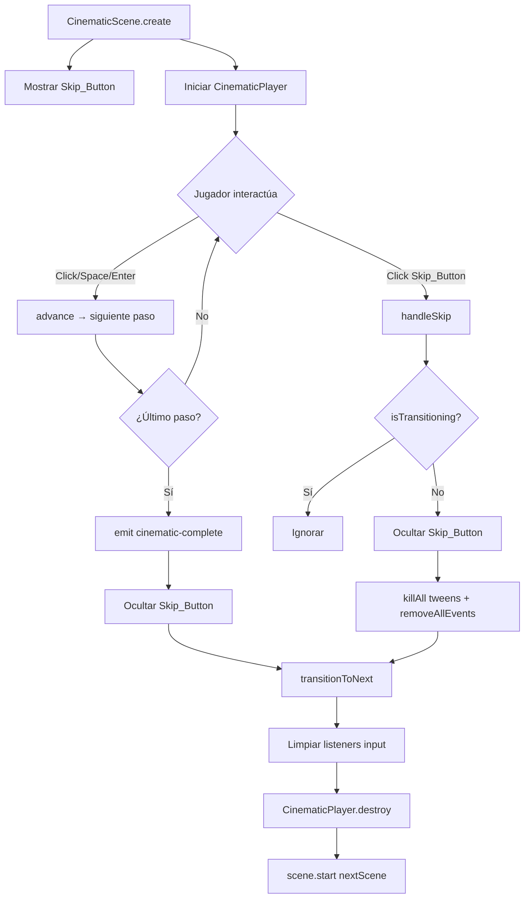

# Diseño: Cinematic Skip

## Overview

Implementación de un botón "Skip" que permite al jugador omitir cinemáticas en curso. El diseño se basa en reutilizar el método `transitionToNext()` existente como único punto de salida, añadiendo una fase de cancelación de efectos previo a la transición. La implementación es mínima: se modifica `CinematicScene.ts` para añadir el botón y la lógica de guard, y se ajusta `CinematicPlayer.ts` si es necesario para garantizar una limpieza completa.

## Architecture

```
src/
├── scenes/
│   └── CinematicScene.ts     # (modificar) Agregar Skip_Button + guard flag + cancelación
├── cinematic/
│   └── CinematicPlayer.ts    # (sin cambios) destroy() ya limpia typewriter y talking animation
└── config/
    └── font-config.ts        # (sin cambios) Se reutiliza GAME_FONT_FAMILY
```

### Diagrama de Flujo: Skip vs Finalización Normal



## Components and Interfaces

### Cambios en CinematicScene.ts

#### Nueva propiedad: `skipButton`

```typescript
private skipButton: Phaser.GameObjects.Text | null = null;
```

Elemento de texto Phaser posicionado en la esquina superior derecha, depth 50.

#### Nueva propiedad: `isTransitioningToNext`

```typescript
private isTransitioningToNext = false;
```

Flag booleano que previene la doble ejecución de `transitionToNext()`. Se establece a `true` al inicio del método y no se resetea.

#### Nuevo método: `createSkipButton()`

Crea el botón Skip durante `create()`:

```typescript
private createSkipButton(): void {
  const { width } = this.cameras.main;
  this.skipButton = this.add.text(width - 20, 20, 'Skip', {
    fontFamily: GAME_FONT_FAMILY,
    fontSize: '14px',
    color: '#ffffff',
  })
    .setOrigin(1, 0)    // Anclado a la derecha
    .setDepth(50)
    .setAlpha(0.7)
    .setInteractive({ useHandCursor: true });

  this.skipButton.on('pointerover', () => {
    this.skipButton?.setAlpha(1.0);
  });
  this.skipButton.on('pointerout', () => {
    this.skipButton?.setAlpha(0.7);
  });
  this.skipButton.on('pointerdown', this.handleSkip, this);
}
```

#### Nuevo método: `handleSkip()`

Orquesta la secuencia de skip:

```typescript
private handleSkip(): void {
  if (this.isTransitioningToNext) return;

  // Desactivar botón inmediatamente
  this.hideSkipButton();

  // Cancelar todos los efectos activos de la escena
  this.tweens.killAll();
  this.time.removeAllEvents();

  // Transicionar usando el mismo flujo que la finalización normal
  this.transitionToNext();
}
```

#### Nuevo método: `hideSkipButton()`

```typescript
private hideSkipButton(): void {
  if (this.skipButton) {
    this.skipButton.disableInteractive();
    this.skipButton.setVisible(false);
  }
}
```

#### Modificación de `transitionToNext()`

Se añade el guard flag al inicio:

```typescript
private transitionToNext(): void {
  if (!this.sceneData) return;
  if (this.isTransitioningToNext) return;  // ← Guard contra doble ejecución
  this.isTransitioningToNext = true;       // ← Marcar como en transición

  // Ocultar botón skip (para el caso de finalización normal)
  this.hideSkipButton();

  // ... resto del método existente sin cambios ...
}
```

### Sin cambios en CinematicPlayer.ts

El método `destroy()` actual ya realiza la limpieza necesaria:
1. `stopTalkingAnimation()` — detiene el tween de talking y resetea escala/posición
2. Destruye `typewriterTimer` si está activo

Los tweens de fade (creados en la escena vía `this.scene.tweens.add`) son cancelados por `this.tweens.killAll()` en CinematicScene antes de invocar `destroy()`, por lo que no se necesitan cambios adicionales.

## Data Models

No se introducen nuevos modelos de datos. El feature opera sobre las estructuras existentes:

- `CinematicSceneData` — sin cambios
- `CinematicData` / `CinematicStep` — sin cambios
- Los archivos JSON de cinemáticas no se modifican

### Estado interno nuevo en CinematicScene

| Propiedad | Tipo | Valor Inicial | Descripción |
|-----------|------|---------------|-------------|
| `skipButton` | `Phaser.GameObjects.Text \| null` | `null` | Referencia al botón de skip |
| `isTransitioningToNext` | `boolean` | `false` | Guard contra doble transición |

## Correctness Properties

*Una propiedad es una característica o comportamiento que debe mantenerse verdadero en todas las ejecuciones válidas de un sistema — esencialmente, una declaración formal sobre lo que el sistema debe hacer. Las propiedades sirven como puente entre especificaciones legibles por humanos y garantías de corrección verificables por máquina.*

### Property 1: Guard contra doble transición

*Para cualquier* secuencia de invocaciones a `transitionToNext()` (ya sea por skip, finalización normal, o combinación de ambos en rápida sucesión), la transición a la siguiente escena (`scene.start`) SHALL ejecutarse exactamente una vez.

**Validates: Requirements 2.4, 4.3**

### Property 2: Cancelación completa de efectos en cualquier estado

*Para cualquier* estado del CinematicPlayer (combinación de typewriting activo/inactivo, fade en progreso/completado, talking animation activa/detenida), cuando se ejecuta el skip, todos los tweens activos de la escena SHALL ser eliminados, todos los timers programados SHALL ser removidos, y el typewriterTimer y talkingTween del player SHALL ser detenidos y nullificados.

**Validates: Requirements 2.1, 2.2, 3.1, 3.2, 3.3, 3.4, 3.5**

### Property 3: Equivalencia de flujo skip vs normal

*Para cualquier* cinemática con N pasos y cualquier punto de interrupción (paso 0..N-1), el skip SHALL invocar `scene.start()` con los mismos parámetros `nextScene` y `nextSceneData` que la finalización normal, resultando en idéntica escena destino con idénticos datos.

**Validates: Requirements 2.3, 5.3**

## Error Handling

| Escenario | Comportamiento |
|-----------|---------------|
| `sceneData` es null al hacer skip | `transitionToNext()` retorna sin efecto (guard existente) |
| Skip durante `isTransitioning` del CinematicPlayer | `handleSkip` ejecuta normalmente — el guard en `transitionToNext` protege la doble ejecución, y `tweens.killAll()` cancela el fade en progreso |
| Skip cuando la cinemática ya finalizó | `isTransitioningToNext` ya es `true`, la pulsación se ignora |
| Botón skip clickeado múltiples veces rápidamente | Primera pulsación desactiva la interactividad inmediatamente; segunda pulsación no llega al handler |

## Testing Strategy

### Tests unitarios (Vitest)

Se pueden testear las siguientes lógicas de forma aislada con mocks de Phaser:

1. **Guard flag**: Verificar que `transitionToNext()` llamado dos veces solo ejecuta `scene.start` una vez
2. **hideSkipButton**: Verificar que desactiva interactividad y oculta visibilidad
3. **handleSkip flow**: Verificar la secuencia: hideSkipButton → killAll → removeAllEvents → transitionToNext

### Tests property-based (fast-check + Vitest)

Se utilizará la librería `fast-check` (ya instalada) con mínimo 100 iteraciones por property:

- **Property 1**: Generar secuencias aleatorias de llamadas (handleSkip, emit cinematic-complete) y verificar que `scene.start` se invoca exactamente 1 vez
- **Property 2**: Generar estados aleatorios del player (combinaciones de isTypewriting, isTransitioning, talkingTween activo) y verificar que después de la cancelación no quedan timers ni tweens activos
- **Property 3**: Generar cinemáticas con pasos aleatorios y puntos de interrupción aleatorios, verificar que nextScene/nextSceneData son consistentes

### Configuración de tests

- Framework: Vitest (ya configurado en package.json)
- PBT: fast-check (ya instalado como devDependency)
- Mínimo 100 iteraciones por test de propiedad
- Tag format: `Feature: cinematic-skip, Property {N}: {texto}`

### Cobertura de testing por requerimiento

| Req. | Tipo de Test | Descripción |
|------|-------------|-------------|
| 1.1-1.5 | Ejemplo | Verificar creación del botón con posición, font, depth, alpha correctos |
| 2.1-2.3 | Property | Guard + flujo único de transición |
| 2.4 | Property | Doble invocación produce una sola transición |
| 3.1-3.5 | Property | Cancelación completa de efectos |
| 4.1-4.3 | Ejemplo | Botón se oculta en finalización normal y en skip |
| 5.1-5.4 | Property + Ejemplo | Equivalencia de flujos + limpieza de listeners |
| 6.1-6.6 | Smoke | Compilación exitosa con tsc y vite build |
