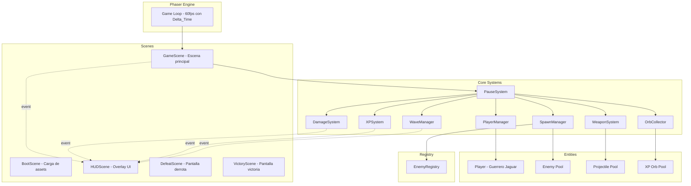
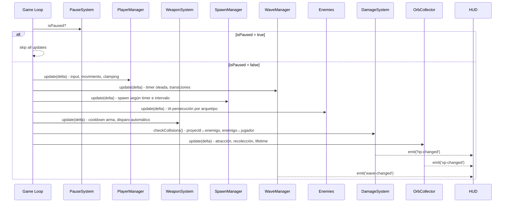
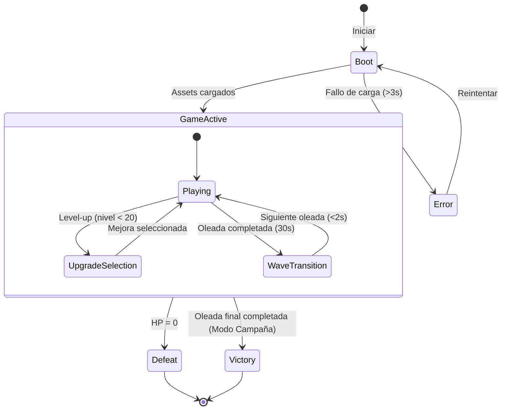

# Design Document: Mictlán Survivor Core

## Overview

Este diseño define la arquitectura técnica del núcleo de mecánicas survivor para "Mictlán - El honor del guerrero jaguar". El sistema implementa un game loop basado en Phaser 3, movimiento 8-direccional con cancelación de ejes independiente, spawn de enemigos con IA de persecución (incluyendo comportamientos especiales por arquetipo), combate automático por proyectiles, progresión XP dual (levelXp / totalXp) con selección de mejoras, oleadas con dificultad exponencial escalable, HUD reactivo, recolección de orbes con atracción magnética, y soporte para Modo Campaña y Modo Infinito.

El juego se construye sobre **Phaser 3** (motor 2D), **TypeScript** (tipado estático), y **Vite** (bundler/HMR). La arquitectura sigue el patrón Scene-based de Phaser con sistemas modulares desacoplados que se comunican mediante eventos. **Todos los cálculos dependientes del tiempo usan Delta_Time** para garantizar independencia de frame rate.

### Decisiones de Diseño Clave

1. **ECS-lite sobre Phaser Scenes**: Usamos GameObjects de Phaser pero con lógica separada en sistemas (SpawnManager, DamageSystem, WaveManager, etc.) para mantener responsabilidad única.
2. **Evento-driven para HUD**: El HUD escucha eventos del EventEmitter de Phaser en lugar de polling, garantizando actualizaciones en el mismo frame.
3. **Object Pooling**: Proyectiles y orbes usan pools para evitar garbage collection spikes y mantener 60fps estables.
4. **EnemyRegistry pattern**: Permite añadir nuevos tipos de enemigos sin modificar código existente (Open/Closed Principle).
5. **Configuración por datos**: Oleadas, enemigos y armas se definen en objetos de configuración tipados, no hardcodeados.
6. **Pausa completa durante upgrades**: Un flag global `isPaused` congela TODOS los sistemas simultáneamente.
7. **XP dual**: `levelXp` (progreso del nivel actual) y `totalXp` (acumulado total de partida) son contadores separados.
8. **Escalado exponencial**: Las fórmulas de dificultad usan exponentes (0.9^n, 1.15^n, 1.05^n) con topes máximos/mínimos.

## Architecture



### Flujo del Game Loop (cada frame)



### Diagrama de Estados del Juego



### Modos de Juego

- **Modo Campaña**: Tiene un `finalWave` configurado (e.g., 10). Al completar esa oleada, se muestra pantalla de Victoria.
- **Modo Infinito**: `finalWave: null`. Las oleadas continúan indefinidamente; cuando se supera la última oleada configurada, se repiten sus parámetros SIN escalado de dificultad adicional.

## Components and Interfaces

### Scene Layer

```typescript
// BootScene: carga assets, transiciona a GameScene
class BootScene extends Phaser.Scene {
  preload(): void;  // carga sprites, audio
  create(): void;   // transiciona a GameScene al completar
}

// GameScene: escena principal de juego
class GameScene extends Phaser.Scene {
  private player: Player;
  private pauseSystem: PauseSystem;
  private spawnManager: SpawnManager;
  private waveManager: WaveManager;
  private damageSystem: DamageSystem;
  private xpSystem: XPSystem;
  private weaponSystem: WeaponSystem;
  private orbCollector: OrbCollector;
  private gameMode: GameModeConfig;

  create(): void;
  update(time: number, delta: number): void;  // delega a sistemas si !isPaused
}

// HUDScene: overlay paralelo a GameScene
class HUDScene extends Phaser.Scene {
  private healthBar: HealthBar;
  private xpBar: XPBar;
  private waveDisplay: WaveDisplay;
  private timerDisplay: TimerDisplay;
  private levelUpPanel: LevelUpPanel;

  create(): void;   // bindea event listeners
}

// DefeatScene: muestra stats de derrota
class DefeatScene extends Phaser.Scene {
  // Muestra: tiempo supervivencia, XP total
}

// VictoryScene: muestra stats de victoria (solo Modo Campaña)
class VictoryScene extends Phaser.Scene {
  // Muestra: tiempo total, oleada máxima, enemigos derrotados, XP total, nivel
}
```

### PauseSystem

**Responsabilidad**: Controlar la pausa global durante la selección de mejoras.

**Requisitos que satisface**: 5.4, 5.5, 5.9, 5.10, 5.11

```typescript
class PauseSystem {
  private _isPaused: boolean = false;

  get isPaused(): boolean;

  /**
   * Pausa TODOS los sistemas: movimiento jugador, enemigos, proyectiles,
   * armas+cooldowns, físicas+colisiones, daño, spawns, timer oleada,
   * timer supervivencia, movimiento y recolección de orbes.
   */
  pause(): void;

  /**
   * Reanuda todos los sistemas desde el estado anterior a la pausa.
   */
  resume(): void;
}
```

### Entity Layer

```typescript
class Player extends Phaser.Physics.Arcade.Sprite {
  hp: number;
  maxHp: number;
  level: number;
  levelXp: number;       // XP acumulada en el nivel actual
  totalXp: number;       // XP total de la partida
  xpThreshold: number;   // nivel_actual * 10 + 5
  speed: number;         // 200 px/s base

  move(direction: Phaser.Math.Vector2, delta: number): void;
  takeDamage(amount: number): void;
  heal(amount: number): void;
  addXP(value: number): LevelUpResult;
}

interface LevelUpResult {
  leveledUp: boolean;
  newLevel: number;
  excessXp: number;
  reachedMaxLevel: boolean;  // true si newLevel >= 20
}
```

### Enemy Hierarchy

```typescript
interface IEnemy {
  hp: number;
  maxHp: number;
  speed: number;
  damage: number;
  xpReward: number;
  update(delta: number, playerPos: Phaser.Math.Vector2): void;
  takeDamage(amount: number): void;
  onDefeat(): void;
}

abstract class Enemy extends Phaser.Physics.Arcade.Sprite implements IEnemy {
  abstract hp: number;
  abstract maxHp: number;
  abstract speed: number;
  abstract damage: number;
  abstract xpReward: number;

  abstract update(delta: number, playerPos: Phaser.Math.Vector2): void;
  takeDamage(amount: number): void;
  onDefeat(): void;  // emite evento, spawna orbe
}

// Esqueleto: persecución directa
class Esqueleto extends Enemy {
  hp = 30; speed = 80; damage = 5; xpReward = 5;
  update(delta, playerPos): void;  // dirección directa a playerPos
}

// Murciélago: persecución con zigzag perpendicular a dirección de avance
class Murcielago extends Enemy {
  hp = 15; speed = 150; damage = 3; xpReward = 3;
  private zigzagPhase: number;
  private zigzagAmplitude: number;
  update(delta, playerPos): void;  // oscilación perpendicular al vector de avance
}

// Calavera Llameante: persecución directa + explosión al morir
class CalaveraLlameante extends Enemy {
  hp = 50; speed = 60; damage = 10; xpReward = 10;
  private explosionRadius = 100;  // px
  private explosionDamage = 15;
  update(delta, playerPos): void;  // persecución directa
  onDefeat(): void;  // explota: 15 daño al jugador si está dentro de 100px
}

// Serpiente Emplumada: persecución con aceleración progresiva
class SerpienteEmplumada extends Enemy {
  hp = 80; speed = 100; damage = 8; xpReward = 15;
  private currentSpeed: number;
  private acceleration: number;
  private maxSpeed: number;  // configurable
  update(delta, playerPos): void;  // acelera progresivamente hasta maxSpeed
}
```

### System Layer

#### PlayerManager

**Responsabilidad**: Procesar input de teclado, calcular dirección con cancelación de ejes independiente, normalizar vectores diagonales, aplicar movimiento con delta time, clampar posición a límites del mapa.

**Requisitos que satisface**: 2.1, 2.2, 2.3, 2.4, 2.5, 2.6

```typescript
class PlayerManager {
  private player: Player;
  private cursors: Phaser.Types.Input.Keyboard.CursorKeys;
  private wasd: { W, A, S, D };

  /**
   * Calcula dirección: teclas opuestas en un eje se cancelan solo en ese eje.
   * W+S+D → (1, 0); A+D sin vertical → (0, 0)
   * Normaliza diagonal para mantener magnitud = speed.
   * Aplica delta time al desplazamiento.
   * Clampa posición final a [0, 3200]×[0, 3200].
   */
  update(delta: number): void;

  private calculateDirection(): Phaser.Math.Vector2;
}
```

#### SpawnManager

**Responsabilidad**: Generar enemigos según configuración de oleada, validando 3 condiciones simultáneas de posición. Eliminar enemigos lejanos (>1500px). Respetar cap de maxEnemies configurable por oleada.

**Requisitos que satisface**: 3.1, 3.2, 3.5, 3.6, 3.7

```typescript
class SpawnManager {
  private enemyPool: Phaser.GameObjects.Group;
  private spawnTimer: number;         // acumula delta time
  private spawnInterval: number;      // configurable por oleada
  private maxEnemies: number;         // configurable por oleada, default 100
  private despawnDistance: number;     // 1500px

  update(delta: number): void;
  setWaveConfig(config: WaveConfig): void;
  getActiveEnemyCount(): number;

  /**
   * Genera posición que cumple 3 condiciones simultáneas:
   * 1. Fuera del viewport de la cámara
   * 2. Dentro de límites del mapa (3200×3200)
   * 3. Entre 50 y 300px del borde visible de la cámara
   * 
   * Si no existe posición válida → retorna null (cancela spawn,
   * reintenta en siguiente intervalo).
   */
  private findValidSpawnPosition(camera: Phaser.Cameras.Scene2D.Camera): Phaser.Math.Vector2 | null;

  /**
   * Elimina enemigos a >1500px del jugador sin otorgar XP ni orbe.
   */
  private despawnDistantEnemies(playerPos: Phaser.Math.Vector2): void;
}
```

#### WaveManager

**Responsabilidad**: Controlar duración de oleadas (30s), transiciones (<2s), calcular escalado de dificultad con fórmulas exponenciales, determinar condición de victoria (Campaña) o continuación infinita.

**Requisitos que satisface**: 6.1, 6.2, 6.3, 6.4, 6.5

```typescript
class WaveManager {
  private currentWave: number;
  private waveTimer: number;           // acumula delta time
  private waveDuration: number;        // 30s
  private transitionTimer: number;
  private gameMode: GameModeConfig;
  private waveConfigs: WaveConfig[];   // configuraciones predefinidas

  update(delta: number): void;
  getCurrentWave(): number;
  getWaveConfig(): WaveConfig;

  /**
   * Fórmulas de escalado exponencial:
   * spawnInterval = max(baseSpawnInterval × 0.9^(wave-1), 0.5)
   * hpMultiplier = min(1.15^(wave-1), 5)
   * speedMultiplier = min(1.05^(wave-1), 2)
   */
  calculateDifficulty(wave: number): DifficultyParams;

  /**
   * Campaña: retorna true si currentWave > finalWave
   * Infinito: siempre false
   */
  isVictory(): boolean;

  /**
   * Para modo infinito: si wave > últimaOleadaConfigurada,
   * repite parámetros de la última sin escalado adicional.
   */
  private resolveWaveConfig(wave: number): WaveConfig;
}
```

#### DamageSystem

**Responsabilidad**: Detectar colisiones proyectil↔enemigo y enemigo↔jugador. Aplicar daño con cooldown de contacto (1000ms por enemigo). Gestionar explosión de Calavera Llameante al morir. Emitir eventos de cambio de HP.

**Requisitos que satisface**: 4.1, 4.2, 4.3, 4.4, 4.5, 9.1 (explosión Calavera)

```typescript
class DamageSystem {
  private contactCooldowns: Map<string, number>;  // enemyId → lastDamageTime
  private contactCooldownMs: number;  // 1000ms

  checkProjectileEnemyCollisions(): void;
  checkEnemyPlayerCollisions(delta: number): void;

  /**
   * Al destruir Calavera Llameante: si jugador está a ≤100px,
   * aplicar 15 de daño al jugador.
   */
  handleEnemyDefeat(enemy: Enemy, playerPos: Phaser.Math.Vector2): void;
}
```

#### XPSystem

**Responsabilidad**: Gestionar XP dual (levelXp y totalXp). Calcular umbrales. Ejecutar lógica de level-up con carry-over de exceso. Determinar cuándo mostrar panel de mejoras (nivel < 20, pool no vacío). Manejar nivel 20 (stop level, continue totalXp).

**Requisitos que satisface**: 5.1, 5.2, 5.6, 5.7, 5.9, 5.10, 5.11, 8.3, 8.6

```typescript
class XPSystem {
  private upgradePool: Upgrade[];

  /**
   * Fórmula: nivel_actual × 10 + 5
   */
  calculateThreshold(level: number): number;

  /**
   * Incrementa levelXp y totalXp por value.
   * Si level = 20: solo incrementa totalXp, levelXp se mantiene en threshold.
   * Si levelXp >= threshold y level < 20:
   *   - level++
   *   - levelXp -= threshold (exceso se conserva)
   *   - Si level < 20 Y upgradePool no vacío: pausa + panel
   *   - Si level = 20 O upgradePool vacío: NO pausa, NO panel
   */
  addXP(player: Player, value: number): LevelUpResult;

  /**
   * Retorna min(3, pool.length) upgrades únicos aleatorios.
   * Si pool vacío: retorna array vacío (no se muestra panel).
   */
  getRandomUpgrades(count: number): Upgrade[];

  applyUpgrade(player: Player, upgrade: Upgrade): void;
  removeUpgradeFromPool(upgradeId: string): void;
}
```

#### WeaponSystem

**Responsabilidad**: Disparar automáticamente al enemigo más cercano dentro de 800px. Manejar cooldown del arma con delta time. Gestionar pool de proyectiles. Destruir proyectiles a 1000px de distancia recorrida.

**Requisitos que satisface**: 4.1, 4.6

```typescript
class WeaponSystem {
  private fireRate: number;          // base: 1000ms
  private fireTimer: number;         // acumula delta time
  private projectilePool: Phaser.GameObjects.Group;
  private range: number;             // 800px
  private damage: number;            // base: 10
  private projectileSpeed: number;
  private maxProjectileDistance: number;  // 1000px

  update(delta: number, playerPos: Phaser.Math.Vector2, enemies: Enemy[]): void;

  /**
   * Encuentra el enemigo con menor distancia euclidiana al jugador,
   * siempre que esté dentro de range (800px).
   * Si ninguno está en rango, retorna null (no dispara).
   */
  findClosestEnemy(playerPos: Phaser.Math.Vector2, enemies: Enemy[]): Enemy | null;

  private fireProjectile(from: Phaser.Math.Vector2, target: Enemy): void;
  private updateProjectiles(delta: number): void;
}
```

#### OrbCollector

**Responsabilidad**: Gestionar pool de orbes de XP. Aplicar atracción magnética (≤100px → 400px/s hacia jugador). Detectar colisión para recolección. Gestionar lifetime (30s). Respetar cap de 200 orbes (FIFO para eliminación). Durante pausa: NO mover ni recolectar orbes.

**Requisitos que satisface**: 8.1, 8.2, 8.3, 8.4, 8.5, 8.6

```typescript
class OrbCollector {
  private orbPool: Phaser.GameObjects.Group;
  private attractRadius: number;     // 100px
  private attractSpeed: number;      // 400 px/s
  private maxOrbs: number;           // 200
  private orbLifetime: number;       // 30s
  private orbTimestamps: Map<string, number>;  // orbId → creationTime

  spawnOrb(position: Phaser.Math.Vector2, value: number): void;
  update(delta: number, playerPos: Phaser.Math.Vector2): void;

  private attractOrb(orb: XPOrb, playerPos: Phaser.Math.Vector2, delta: number): void;
  private collectOrb(orb: XPOrb): void;
  private removeExpiredOrbs(currentTime: number): void;
  private enforceOrbCap(): void;  // elimina más antiguos si > 200
}
```

#### EnemyRegistry

**Responsabilidad**: Registrar factories de enemigos por tipo. Crear instancias sin acoplar SpawnManager a implementaciones concretas. Permitir extensibilidad (Open/Closed).

**Requisitos que satisface**: 9.2, 9.5

```typescript
type EnemyFactory = (scene: Phaser.Scene, x: number, y: number, config: EnemySpawnConfig) => Enemy;

class EnemyRegistry {
  private registry: Map<string, EnemyFactory>;

  register(type: string, factory: EnemyFactory): void;
  create(type: string, scene: Phaser.Scene, x: number, y: number, config: EnemySpawnConfig): Enemy;
  getRegisteredTypes(): string[];
  has(type: string): boolean;
}
```

#### HUD Components

**Responsabilidad**: Mostrar información de estado en tiempo real. Actualizar en el mismo frame vía eventos. Gestionar panel de selección de mejoras.

**Requisitos que satisface**: 7.1, 7.2, 7.3, 7.4, 7.5, 7.6, 5.3, 5.8

```typescript
class HealthBar {
  /** fillRatio = hp / maxHp, clamped [0, 1] */
  update(hp: number, maxHp: number): void;
}

class XPBar {
  /**
   * fillRatio = levelXp / threshold, clamped [0, 1].
   * Tras level-up: muestra excessXp / newThreshold × 100%.
   * En nivel 20: permanece a 100%.
   */
  update(levelXp: number, threshold: number, isMaxLevel: boolean): void;
}

class WaveDisplay {
  update(waveNumber: number): void;
  showWaveAnnouncement(waveNumber: number): void;
}

class TimerDisplay {
  /** Formato MM:SS. MM = floor(s/60) pad 2, SS = (s%60) pad 2 */
  update(elapsedSeconds: number): void;
}

class LevelUpPanel {
  show(upgrades: Upgrade[]): void;
  hide(): void;
  onSelect: (upgrade: Upgrade) => void;
}
```

## Data Models

### Configuración de Modos de Juego

```typescript
interface GameModeConfig {
  mode: 'campaign' | 'infinite';
  finalWave: number | null;  // null para modo infinito
}
```

### Configuración de Oleadas

```typescript
interface WaveConfig {
  waveNumber: number;
  duration: number;            // 30 seconds
  spawnInterval: number;       // calculado por fórmula exponencial
  maxEnemies: number;          // configurable por oleada, default 100
  enemyTypes: EnemyTypeWeight[];
  hpMultiplier: number;        // calculado: min(1.15^(wave-1), 5)
  speedMultiplier: number;     // calculado: min(1.05^(wave-1), 2)
}

interface EnemyTypeWeight {
  type: string;       // key en EnemyRegistry
  weight: number;     // probabilidad relativa
}

interface DifficultyParams {
  spawnInterval: number;    // max(2 × 0.9^(wave-1), 0.5)
  hpMultiplier: number;     // min(1.15^(wave-1), 5)
  speedMultiplier: number;  // min(1.05^(wave-1), 2)
}
```

### Configuración de Enemigos

```typescript
interface EnemyConfig {
  key: string;
  hp: number;
  speed: number;          // px/s (base, antes de multiplicador)
  damage: number;
  xpReward: number;
  spriteKey: string;
  behavior: EnemyBehaviorConfig;
}

type EnemyBehaviorConfig =
  | { type: 'direct_chase' }
  | { type: 'zigzag_chase'; amplitude: number; frequency: number }
  | { type: 'explode_on_death'; explosionRadius: number; explosionDamage: number }
  | { type: 'accelerating_chase'; acceleration: number; maxSpeed: number };

interface EnemySpawnConfig {
  hpMultiplier: number;
  speedMultiplier: number;
}
```

### Estado del Jugador

```typescript
interface PlayerState {
  hp: number;
  maxHp: number;           // base: 100
  level: number;           // 1-20
  levelXp: number;         // XP acumulada en nivel actual
  totalXp: number;         // XP total de toda la partida
  xpThreshold: number;     // nivel_actual × 10 + 5
  speed: number;           // base: 200 px/s
  weapon: WeaponConfig;
  upgrades: Upgrade[];
}

interface WeaponConfig {
  damage: number;           // base: 10
  fireRate: number;         // base: 1000ms
  range: number;            // base: 800px
  projectileSpeed: number;
  maxDistance: number;       // 1000px antes de destruirse
}
```

### Sistema de Mejoras

```typescript
interface Upgrade {
  id: string;
  name: string;
  description: string;
  apply(player: Player): void;
}

type UpgradePool = Upgrade[];
```

### Configuración del Mapa

```typescript
interface MapConfig {
  width: number;      // 3200px
  height: number;     // 3200px
}
```

### Escalado de Dificultad (Fórmulas Exponenciales)

```typescript
/**
 * Fórmulas de escalado exponencial por oleada:
 *
 * spawnInterval = max(baseSpawnInterval × 0.9^(wave - 1), 0.5)
 *   → Reducción acumulativa del 10% por oleada, mínimo 0.5s
 *
 * hpMultiplier = min(1.15^(wave - 1), 5)
 *   → Incremento del 15% compuesto por oleada, máximo 5x
 *
 * speedMultiplier = min(1.05^(wave - 1), 2)
 *   → Incremento del 5% compuesto por oleada, máximo 2x
 */
function calculateDifficulty(wave: number, baseSpawnInterval: number = 2): DifficultyParams {
  return {
    spawnInterval: Math.max(baseSpawnInterval * Math.pow(0.9, wave - 1), 0.5),
    hpMultiplier: Math.min(Math.pow(1.15, wave - 1), 5),
    speedMultiplier: Math.min(Math.pow(1.05, wave - 1), 2),
  };
}
```

### Progresión de Enemigos por Oleada

```typescript
const WAVE_ENEMY_PROGRESSION: Record<number, string[]> = {
  // Oleadas 1-3: solo Esqueletos
  1: ['esqueleto'], 2: ['esqueleto'], 3: ['esqueleto'],
  // Oleadas 4-6: Esqueletos + Murciélagos
  4: ['esqueleto', 'murcielago'], 5: ['esqueleto', 'murcielago'], 6: ['esqueleto', 'murcielago'],
  // Oleadas 7-8: + Calavera Llameante
  7: ['esqueleto', 'murcielago', 'calavera_llameante'], 8: ['esqueleto', 'murcielago', 'calavera_llameante'],
  // Oleadas 9-10: los 4 tipos
  9: ['esqueleto', 'murcielago', 'calavera_llameante', 'serpiente_emplumada'],
  10: ['esqueleto', 'murcielago', 'calavera_llameante', 'serpiente_emplumada'],
};
```

### Constantes del Juego

```typescript
const GAME_CONSTANTS = {
  // Player
  PLAYER_BASE_SPEED: 200,           // px/s
  PLAYER_BASE_HP: 100,
  MAX_LEVEL: 20,

  // Map
  MAP_WIDTH: 3200,
  MAP_HEIGHT: 3200,

  // Waves
  WAVE_DURATION: 30,                // seconds
  WAVE_TRANSITION_TIME: 2,          // seconds
  BASE_SPAWN_INTERVAL: 2,           // seconds

  // Enemies
  DEFAULT_MAX_ENEMIES: 100,         // configurable per wave
  ENEMY_DESPAWN_DISTANCE: 1500,     // px

  // Spawn positioning
  SPAWN_MIN_DISTANCE_FROM_EDGE: 50,   // px del borde visible
  SPAWN_MAX_DISTANCE_FROM_EDGE: 300,  // px del borde visible

  // Weapon
  WEAPON_BASE_DAMAGE: 10,
  WEAPON_BASE_FIRE_RATE: 1000,      // ms
  WEAPON_RANGE: 800,                // px
  PROJECTILE_MAX_DISTANCE: 1000,    // px

  // Combat
  CONTACT_DAMAGE_COOLDOWN: 1000,    // ms

  // Orbs
  ORB_ATTRACT_RADIUS: 100,          // px
  ORB_ATTRACT_SPEED: 400,           // px/s
  ORB_LIFETIME: 30,                 // seconds
  MAX_ORBS: 200,

  // XP
  XP_THRESHOLD_FORMULA: (level: number) => level * 10 + 5,

  // Difficulty scaling
  SPAWN_INTERVAL_DECAY: 0.9,        // multiplicador por oleada
  MIN_SPAWN_INTERVAL: 0.5,          // seconds (floor)
  HP_SCALING_BASE: 1.15,            // base exponencial HP
  MAX_HP_MULTIPLIER: 5,             // ceiling
  SPEED_SCALING_BASE: 1.05,         // base exponencial velocidad
  MAX_SPEED_MULTIPLIER: 2,          // ceiling

  // Calavera Llameante
  EXPLOSION_RADIUS: 100,            // px
  EXPLOSION_DAMAGE: 15,
} as const;
```

## Correctness Properties

*A property is a characteristic or behavior that should hold true across all valid executions of a system—essentially, a formal statement about what the system should do. Properties serve as the bridge between human-readable specifications and machine-verifiable correctness guarantees.*

### Property 1: Movement Speed Normalization

*For any* valid direction input (single cardinal key or diagonal combination of two non-opposing keys), the resulting velocity vector of the Guerrero_Jaguar SHALL have a magnitude exactly equal to the base speed (200 px/s), regardless of whether the movement is cardinal or diagonal.

**Validates: Requirements 2.1, 2.2**

### Property 2: Axis-Independent Opposing Key Cancellation

*For any* combination of pressed direction keys where two opposing keys are active on one axis (e.g., W+S), the movement on that axis SHALL be zero while movement on the perpendicular axis SHALL be preserved at full speed if an active key exists (e.g., W+S+D → velocity = (200, 0); A+D → velocity = (0, 0)).

**Validates: Requirements 2.6**

### Property 3: Player Boundary Clamping

*For any* player position and movement vector applied over any delta time, the resulting position SHALL always remain within the map boundaries [0, 3200] × [0, 3200] pixels.

**Validates: Requirements 2.5**

### Property 4: Spawn Position Triple Constraint

*For any* spawn event during an active wave and any camera viewport position within the map, the spawned enemy position SHALL simultaneously satisfy: (a) outside the camera viewport, (b) within map bounds [0, 3200]×[0, 3200], and (c) at a distance between 50 and 300 pixels from the nearest visible edge of the camera. If no such position exists, the spawn SHALL be cancelled.

**Validates: Requirements 3.1, 3.2**

### Property 5: Enemy Pursuit Direction

*For any* active enemy at position E and player at position P where E ≠ P, the enemy's base velocity vector SHALL point in the direction from E to P (for direct chase behaviors). The magnitude SHALL equal the enemy's configured speed multiplied by the wave's speedMultiplier.

**Validates: Requirements 3.3**

### Property 6: Enemy Defeat Produces Correctly Valued XP Orb

*For any* enemy of any type defeated at position P, the system SHALL spawn exactly one XP orb at position P with a value equal to that enemy type's configured xpReward.

**Validates: Requirements 3.4, 8.1**

### Property 7: Max Enemies Cap per Wave

*For any* game state during an active wave with configured maxEnemies = M, the count of active enemies SHALL never exceed M. The SpawnManager SHALL not generate new enemies while activeCount >= M.

**Validates: Requirements 3.5**

### Property 8: Enemy Despawn by Distance

*For any* enemy at Euclidean distance D from the Guerrero_Jaguar where D > 1500 pixels, the SpawnManager SHALL remove that enemy from the scene without awarding XP and without spawning an orb.

**Validates: Requirements 3.6**

### Property 9: Closest Enemy Targeting

*For any* set of active enemies and player position, the WeaponSystem SHALL select as target the enemy with the smallest Euclidean distance to the player, provided that distance ≤ 800 pixels. If no enemy is within 800px, no projectile SHALL be fired.

**Validates: Requirements 4.1**

### Property 10: Damage Application and Defeat Trigger

*For any* projectile-enemy collision where the enemy has HP > 0, the enemy's HP SHALL be reduced by the weapon's current damage value and the projectile SHALL be destroyed. If the resulting HP ≤ 0, the enemy SHALL be marked as defeated and trigger onDefeat().

**Validates: Requirements 4.2, 4.3**

### Property 11: Contact Damage Cooldown

*For any* enemy in continuous contact with the Guerrero_Jaguar over any time interval, damage SHALL be applied at most once per 1000 milliseconds per individual enemy, regardless of frame rate or delta time variations.

**Validates: Requirements 4.4**

### Property 12: Projectile Max Travel Distance

*For any* projectile, once it has traveled a cumulative distance ≥ 1000 pixels from its origin point without hitting an enemy, it SHALL be destroyed and removed from the scene.

**Validates: Requirements 4.6**

### Property 13: XP Dual Counter Increment

*For any* XP orb with value V collected by the Guerrero_Jaguar at level L < 20, both levelXp SHALL increase by V and totalXp SHALL increase by V. At level 20, only totalXp SHALL increase by V while levelXp remains capped at the threshold.

**Validates: Requirements 5.1, 8.3, 8.6**

### Property 14: Level-Up Excess Carry-Over

*For any* player at level L (L < 20) with current levelXp X and threshold T, when levelXp reaches or exceeds T: the level SHALL become L+1, levelXp SHALL become (X - T) (the excess), and the new threshold SHALL be (L+1) × 10 + 5. The excess is the starting progress toward the next level.

**Validates: Requirements 5.2**

### Property 15: Upgrade Selection Uniqueness and Count

*For any* level-up event where the upgrade pool contains N upgrades: if N ≥ 3, exactly 3 distinct upgrades SHALL be presented (no duplicates); if 0 < N < 3, all N upgrades SHALL be presented; if N = 0, no panel SHALL be shown and the game SHALL resume immediately.

**Validates: Requirements 5.3, 5.8, 5.9**

### Property 16: XP Threshold Formula

*For any* level L (1 ≤ L ≤ 20), the XP threshold to reach the next level SHALL equal L × 10 + 5. The initial threshold at level 1 SHALL be 15.

**Validates: Requirements 5.6, 5.7**

### Property 17: Exponential Difficulty Scaling with Clamping

*For any* wave number N (N ≥ 1), the difficulty parameters SHALL be: spawnInterval = max(2 × 0.9^(N-1), 0.5), hpMultiplier = min(1.15^(N-1), 5), speedMultiplier = min(1.05^(N-1), 2). These are exponential formulas with hard floors/ceilings.

**Validates: Requirements 6.3**

### Property 18: Infinite Mode Repeats Last Wave Config

*For any* wave number N in Modo Infinito where N exceeds the last configured wave number C, the wave parameters SHALL be identical to wave C's parameters without any additional scaling applied.

**Validates: Requirements 6.5**

### Property 19: Wave-to-Enemy-Type Mapping

*For any* wave number N (1 ≤ N ≤ 10), all spawned enemies SHALL be of a type within the allowed set: waves 1-3 → {Esqueleto}, waves 4-6 → {Esqueleto, Murciélago}, waves 7-8 → {Esqueleto, Murciélago, Calavera Llameante}, waves 9-10 → {all 4 types}. No enemy of a type outside the allowed set SHALL be spawned.

**Validates: Requirements 6.2, 9.4**

### Property 20: Health Bar Proportional Fill

*For any* player state with HP h and maxHP m (m > 0), the health bar fill ratio SHALL equal h/m, clamped to [0, 1].

**Validates: Requirements 7.1**

### Property 21: XP Bar Proportional Fill with Level-Up Excess

*For any* player state: if level < 20, the XP bar fill ratio SHALL equal levelXp/threshold clamped to [0, 1]; after a level-up with excess XP, the bar SHALL show excessXp/newThreshold (NOT reset to 0%); if level = 20, the bar SHALL always show 100%.

**Validates: Requirements 7.2, 7.6, 5.10**

### Property 22: Timer Format MM:SS

*For any* elapsed time in seconds S (S ≥ 0), the HUD timer SHALL display the string formatted as MM:SS where MM = floor(S/60) zero-padded to 2 digits and SS = floor(S mod 60) zero-padded to 2 digits.

**Validates: Requirements 7.3**

### Property 23: Orb Attraction Behavior

*For any* XP orb at position O and player at position P: if Euclidean distance(O, P) ≤ 100 pixels, the orb SHALL move toward P at 400 px/s (scaled by delta time); if distance(O, P) > 100 pixels, the orb SHALL remain stationary.

**Validates: Requirements 8.2**

### Property 24: Orb Lifetime Expiration

*For any* XP orb that has existed in the scene for more than 30 seconds without being collected, the system SHALL remove it from the scene.

**Validates: Requirements 8.4**

### Property 25: Orb Pool Cap with FIFO Removal

*For any* game state, the count of active XP orbs SHALL never exceed 200. When a new orb would exceed the cap, the oldest orb(s) SHALL be removed first to maintain the limit.

**Validates: Requirements 8.5**

### Property 26: Delta Time Independence

*For any* time-dependent calculation (movement, cooldowns, spawn timers, wave timers, orb lifetime, projectile travel, acceleration), the result SHALL scale linearly with delta time. Doubling the delta time SHALL double the displacement/elapsed amount, ensuring frame-rate independence.

**Validates: Requirements 2.1, 3.3, 4.1, 4.4, 6.1, 6.3, 8.2, 8.4**

## Error Handling

### Scene Loading Failure (Req 1.4)
- Si la carga de assets falla o excede 3 segundos, se cancela la carga, se muestra un mensaje de error descriptivo, y se permite reintentar desde el menú principal.
- Los assets individuales que fallen se registran en consola para debugging.

### Pool Overflow
- **Enemigos** (Req 3.5): Cuando los enemigos activos alcanzan el maxEnemies configurado para la oleada (default 100), el SpawnManager detiene generación hasta que haya espacio.
- **Orbes** (Req 8.5): Cuando los orbes activos superan 200, se eliminan los más antiguos (FIFO).

### Spawn Position Invalida (Req 3.2)
- Si el algoritmo de spawn no encuentra una posición que cumpla las 3 condiciones simultáneas (fuera viewport, dentro mapa, 50-300px del borde visible), se cancela el spawn actual y se reintenta en el siguiente intervalo.
- Esto puede ocurrir cuando la cámara está en esquinas extremas del mapa.

### Gameplay Edge Cases
- Si no hay enemigos dentro de 800px, el arma no dispara (Req 4.1).
- Si el pool de mejoras tiene menos de 3 opciones, se muestran todas las disponibles (Req 5.8).
- Si el pool de mejoras está vacío, se omite el panel y se reanuda inmediatamente (Req 5.9).
- Si se alcanza el nivel 20, no se pausa ni se muestran paneles de mejora (Req 5.10, 5.11).
- Teclas opuestas en un eje cancelan SOLO ese eje, preservando movimiento perpendicular (Req 2.6).
- En nivel 20, la recolección de orbes solo incrementa totalXp (Req 8.6).

### Performance Degradation
- Todos los timers y movimientos usan delta time (NFR), evitando spawn bursts o fast-forward en frames lentos.
- Proyectiles y orbes usan object pooling para evitar allocations frecuentes.

### Wave Boundary Cases (Req 6.5)
- **Modo Infinito**: Si el número de oleada excede las configuradas, se repiten los parámetros de la última oleada sin escalar más.
- **Modo Campaña**: Al completar la oleada final, se muestra pantalla de Victoria.
- Los enemigos de una oleada anterior sobreviven la transición a la siguiente oleada (Req 3.7).

### Player Defeat (Req 4.5)
- Cuando HP llega a 0, se muestra pantalla de Derrota con tiempo de supervivencia y XP total.
- El DamageSystem emite evento antes de transicionar para que el HUD muestre el frame final.

## Testing Strategy

### Dual Testing Approach

Este proyecto usa una estrategia de testing dual:

1. **Property-Based Tests** (fast-check) — para validar propiedades universales (26 propiedades)
2. **Unit Tests** (Vitest) — para escenarios específicos, edge cases, e integración

### Property-Based Testing

**Library**: [fast-check](https://github.com/dubzzz/fast-check) con Vitest como runner.

**Configuration**:
- Mínimo 100 iteraciones por propiedad
- Cada test referencia su propiedad del documento de diseño
- Tag format: `Feature: mictlan-survivor-core, Property {N}: {title}`
- Implementar cada propiedad con UN SOLO test property-based

**Scope de las 26 propiedades**:
- Movimiento: normalización de velocidad, cancelación de ejes, boundary clamping (Props 1-3)
- Spawn: triple constraint de posición, cancellation (Prop 4)
- Enemigos: persecución, defeat→orb, caps, despawn, wave mapping (Props 5-8, 19)
- Combate: targeting, damage, cooldown, max distance (Props 9-12)
- XP/Niveles: dual counter, level-up carry-over, upgrades, threshold formula (Props 13-16)
- Dificultad: escalado exponencial, modo infinito (Props 17-18)
- HUD: health bar, XP bar con exceso, timer format (Props 20-22)
- Orbes: atracción, lifetime, cap FIFO (Props 23-25)
- Frame-rate: delta time independence (Prop 26)

### Unit Tests (Example-Based)

**Áreas cubiertas por unit tests**:
- Inicialización de escena: valores correctos al inicio (Req 1.3, 1.5, 5.7)
- Player defeat → pantalla de derrota (Req 4.5)
- Wave transitions: timing ≤2s, display número oleada (Req 6.1)
- Upgrade selection y aplicación (Req 5.5)
- Enemy archetype stats verification — 4 arquetipos con stats correctos (Req 9.1, 9.3)
- Comportamientos especiales: zigzag Murciélago, explosión Calavera, aceleración Serpiente (Req 9.1)
- HUD event reactivity: actualizaciones en mismo frame (Req 7.4, 7.5)
- Error handling: load failures, retry flow (Req 1.4)
- Pausa completa: verificar todos los sistemas congelados (Req 5.4)
- Victoria en Modo Campaña (Req 6.4)
- Enemigos sobreviven transición de oleada (Req 3.7)
- Edge cases: empty upgrade pool (Req 5.9), nivel 20 behavior (Req 5.10, 5.11, 8.6)

### Test Architecture

```
src/
├── systems/
│   ├── __tests__/
│   │   ├── movement.property.test.ts       (Props 1, 2, 3)
│   │   ├── spawn-manager.property.test.ts  (Props 4, 7, 8)
│   │   ├── enemy-behavior.property.test.ts (Props 5, 6)
│   │   ├── weapon-system.property.test.ts  (Props 9, 12)
│   │   ├── damage-system.property.test.ts  (Props 10, 11)
│   │   ├── xp-system.property.test.ts      (Props 13, 14, 15, 16)
│   │   ├── wave-manager.property.test.ts   (Props 17, 18, 19)
│   │   ├── hud.property.test.ts            (Props 20, 21, 22)
│   │   ├── orb-collector.property.test.ts  (Props 23, 24, 25)
│   │   ├── delta-time.property.test.ts     (Prop 26)
│   │   └── *.unit.test.ts
```

### Key Testing Decisions

1. **Pure logic extraction**: Las funciones puras (normalización de vectores, cálculo de threshold, scaling, targeting, timer formatting) se extraen de las clases Phaser para ser testables sin el engine.
2. **Mocking Phaser**: Para tests de integración, se usa un mock mínimo de `Phaser.Math.Vector2` y physics bodies.
3. **No se testa el renderer**: Los tests de HUD verifican los valores computados (fill ratios, formatted strings), no el rendering visual.
4. **fast-check generators**: Se crean generators custom para:
   - Posiciones válidas dentro del mapa (0-3200)
   - Posiciones de cámara
   - Enemy configs con multiplicadores
   - Wave numbers (1-∞)
   - Delta time values (1-100ms)
   - Orb values y posiciones
   - Key combinations (incluyendo opposing pairs)
5. **Delta time testing**: Se generan delta time variados para verificar que los resultados escalan linealmente.

## Traceability Matrix

| Requisito | Componentes que lo implementan | Propiedades |
|-----------|-------------------------------|-------------|
| 1.1 | BootScene, GameScene | — |
| 1.2 | GameScene (game loop) | — |
| 1.3 | GameScene.create() | — |
| 1.4 | BootScene (error handling) | — |
| 1.5 | GameScene.create(), Player | — |
| 2.1 | PlayerManager | Prop 1 |
| 2.2 | PlayerManager | Prop 1 |
| 2.3 | PlayerManager | — |
| 2.4 | GameScene (camera) | — |
| 2.5 | PlayerManager | Prop 3 |
| 2.6 | PlayerManager | Prop 2 |
| 3.1 | SpawnManager | Prop 4 |
| 3.2 | SpawnManager | Prop 4 |
| 3.3 | Enemy subclasses | Prop 5 |
| 3.4 | Enemy.onDefeat(), OrbCollector | Prop 6 |
| 3.5 | SpawnManager, WaveConfig | Prop 7 |
| 3.6 | SpawnManager | Prop 8 |
| 3.7 | SpawnManager, WaveManager | — |
| 4.1 | WeaponSystem | Prop 9 |
| 4.2 | DamageSystem | Prop 10 |
| 4.3 | DamageSystem | Prop 10 |
| 4.4 | DamageSystem | Prop 11 |
| 4.5 | DamageSystem, DefeatScene | — |
| 4.6 | WeaponSystem | Prop 12 |
| 5.1 | XPSystem, OrbCollector | Prop 13 |
| 5.2 | XPSystem | Prop 14 |
| 5.3 | XPSystem, LevelUpPanel | Prop 15 |
| 5.4 | PauseSystem | — |
| 5.5 | PauseSystem, XPSystem | — |
| 5.6 | XPSystem | Prop 16 |
| 5.7 | XPSystem, GameScene.create() | Prop 16 |
| 5.8 | XPSystem, LevelUpPanel | Prop 15 |
| 5.9 | XPSystem | Prop 15 |
| 5.10 | XPSystem | Prop 21 |
| 5.11 | XPSystem, PauseSystem | — |
| 6.1 | WaveManager, HUD | — |
| 6.2 | WaveManager, SpawnManager | Prop 19 |
| 6.3 | WaveManager | Prop 17 |
| 6.4 | WaveManager, VictoryScene | — |
| 6.5 | WaveManager | Prop 18 |
| 7.1 | HealthBar | Prop 20 |
| 7.2 | XPBar | Prop 21 |
| 7.3 | TimerDisplay | Prop 22 |
| 7.4 | HealthBar (event-driven) | — |
| 7.5 | XPBar (event-driven) | — |
| 7.6 | XPBar | Prop 21 |
| 8.1 | OrbCollector | Prop 6 |
| 8.2 | OrbCollector | Prop 23 |
| 8.3 | XPSystem, OrbCollector | Prop 13 |
| 8.4 | OrbCollector | Prop 24 |
| 8.5 | OrbCollector | Prop 25 |
| 8.6 | XPSystem | Prop 13 |
| 9.1 | Esqueleto, Murcielago, CalaveraLlameante, SerpienteEmplumada | — |
| 9.2 | Enemy (abstract class) | — |
| 9.3 | Enemy subclasses | — |
| 9.4 | WaveManager, SpawnManager | Prop 19 |
| 9.5 | EnemyRegistry | — |
| NFR-Perf | Object Pooling, Game Loop | — |
| NFR-DeltaTime | Todos los sistemas | Prop 26 |
| NFR-Maintain | Estructura modular de sistemas | — |
