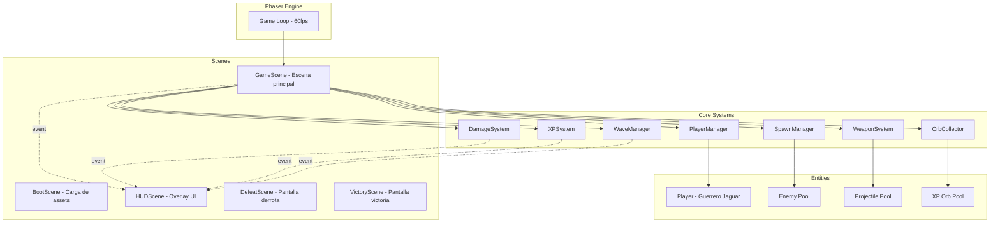
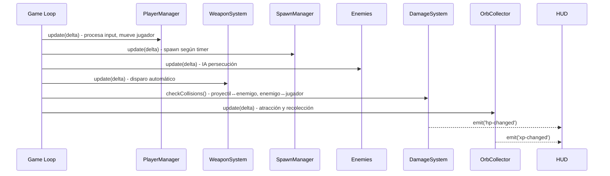

# Design Document: Mictlán Survivor Core

## Overview

Este diseño define la arquitectura técnica del núcleo de mecánicas survivor para "Mictlán - El honor del guerrero jaguar". El sistema implementa un game loop basado en Phaser, movimiento 8-direccional, spawn de enemigos con IA de persecución, combate automático por proyectiles, progresión XP/niveles con selección de mejoras, oleadas con dificultad escalable, HUD reactivo, y recolección de orbes con sistema de atracción magnética.

El juego se construye sobre Phaser (motor de juego 2D), TypeScript (tipado estático), y Vite (bundler/HMR). La arquitectura sigue el patrón Scene-based de Phaser con sistemas modulares desacoplados que se comunican mediante eventos.

### Decisiones de Diseño Clave

1. **ECS-lite sobre Phaser Scenes**: Usamos el sistema de GameObjects de Phaser pero con lógica separada en sistemas (SpawnManager, DamageSystem, WaveManager) para mantener responsabilidad única.
2. **Evento-driven para HUD**: El HUD escucha eventos del EventEmitter de Phaser en lugar de polling, garantizando actualizaciones en el mismo frame.
3. **Object Pooling para proyectiles y orbes**: Evita garbage collection spikes manteniendo 60fps estables.
4. **EnemyRegistry pattern**: Permite añadir nuevos tipos de enemigos sin modificar código existente (Open/Closed Principle).
5. **Configuración por datos**: Los parámetros de oleadas, enemigos y armas se definen en objetos de configuración tipados, no hardcodeados en lógica.

## Architecture



### Flujo del Game Loop (cada frame)



## Components and Interfaces

### Scene Layer

```typescript
// BootScene: carga assets, transiciona a GameScene
class BootScene extends Phaser.Scene {
  preload(): void;  // carga sprites, audio
  create(): void;   // transiciona a GameScene
}

// GameScene: escena principal de juego
class GameScene extends Phaser.Scene {
  private player: Player;
  private spawnManager: SpawnManager;
  private waveManager: WaveManager;
  private damageSystem: DamageSystem;
  private xpSystem: XPSystem;
  private weaponSystem: WeaponSystem;
  private orbCollector: OrbCollector;

  create(): void;           // inicializa sistemas y entidades
  update(time: number, delta: number): void;  // game loop principal
}

// HUDScene: overlay paralelo a GameScene
class HUDScene extends Phaser.Scene {
  private healthBar: HealthBar;
  private xpBar: XPBar;
  private waveDisplay: WaveDisplay;
  private timerDisplay: TimerDisplay;
  private levelUpPanel: LevelUpPanel;

  create(): void;   // bindea event listeners
}
```

### Entity Layer

```typescript
interface IEnemy {
  hp: number;
  maxHp: number;
  speed: number;
  damage: number;
  xpReward: number;
  update(delta: number, playerPos: Phaser.Math.Vector2): void;
  takeDamage(amount: number): void;
  onDefeat(): void;
}

class Player extends Phaser.Physics.Arcade.Sprite {
  hp: number;
  maxHp: number;
  level: number;
  xp: number;
  xpThreshold: number;
  speed: number;

  move(direction: Phaser.Math.Vector2): void;
  takeDamage(amount: number): void;
  heal(amount: number): void;
  addXP(amount: number): boolean;  // returns true if leveled up
}

abstract class Enemy extends Phaser.Physics.Arcade.Sprite implements IEnemy {
  abstract hp: number;
  abstract maxHp: number;
  abstract speed: number;
  abstract damage: number;
  abstract xpReward: number;

  abstract update(delta: number, playerPos: Phaser.Math.Vector2): void;
  takeDamage(amount: number): void;
  onDefeat(): void;
}
```

### System Layer

```typescript
class SpawnManager {
  private enemyPool: Phaser.GameObjects.Group;
  private spawnTimer: number;
  private maxEnemies: number;
  private despawnDistance: number;

  update(delta: number): void;
  setWaveConfig(config: WaveConfig): void;
  getActiveEnemyCount(): number;
}

class WaveManager {
  private currentWave: number;
  private waveTimer: number;
  private waveDuration: number;

  update(delta: number): void;
  getCurrentWave(): number;
  getWaveConfig(): WaveConfig;
  isVictory(): boolean;
}

class DamageSystem {
  checkProjectileEnemyCollisions(): void;
  checkEnemyPlayerCollisions(delta: number): void;
}

class XPSystem {
  calculateThreshold(level: number): number;  // nivel * 10 + 5
  tryLevelUp(player: Player): boolean;
  getRandomUpgrades(count: number): Upgrade[];
}

class WeaponSystem {
  private fireRate: number;
  private fireTimer: number;
  private projectilePool: Phaser.GameObjects.Group;
  private range: number;
  private damage: number;

  update(delta: number, playerPos: Phaser.Math.Vector2, enemies: Enemy[]): void;
  findClosestEnemy(playerPos: Phaser.Math.Vector2, enemies: Enemy[]): Enemy | null;
}

class OrbCollector {
  private orbPool: Phaser.GameObjects.Group;
  private attractRadius: number;
  private attractSpeed: number;
  private maxOrbs: number;
  private orbLifetime: number;

  spawnOrb(position: Phaser.Math.Vector2, value: number): void;
  update(delta: number, playerPos: Phaser.Math.Vector2): void;
}
```

### Registry Pattern

```typescript
type EnemyFactory = (scene: Phaser.Scene, x: number, y: number) => Enemy;

class EnemyRegistry {
  private registry: Map<string, EnemyFactory>;

  register(type: string, factory: EnemyFactory): void;
  create(type: string, scene: Phaser.Scene, x: number, y: number): Enemy;
  getRegisteredTypes(): string[];
}
```

## Data Models

### Configuración de Oleadas

```typescript
interface WaveConfig {
  waveNumber: number;
  duration: number;          // 30 seconds
  spawnInterval: number;     // seconds between spawns
  maxEnemies: number;        // max concurrent enemies
  enemyTypes: EnemyTypeWeight[];
  hpMultiplier: number;      // escalado de HP enemigos
  speedMultiplier: number;   // escalado de velocidad
}

interface EnemyTypeWeight {
  type: string;       // key en EnemyRegistry
  weight: number;     // probabilidad relativa
}
```

### Configuración de Enemigos

```typescript
interface EnemyConfig {
  key: string;            // "skeleton", "bat", "flaming_skull", "feathered_serpent"
  hp: number;
  speed: number;          // px/s
  damage: number;
  xpReward: number;
  spriteKey: string;
  behavior: EnemyBehavior;
}

type EnemyBehavior = 'direct_chase' | 'dash_chase' | 'explode_on_death' | 'accelerating_chase';
```

### Estado del Jugador

```typescript
interface PlayerState {
  hp: number;
  maxHp: number;
  level: number;
  xp: number;
  xpThreshold: number;    // nivel * 10 + 5
  speed: number;
  weapon: WeaponConfig;
  upgrades: Upgrade[];
}

interface WeaponConfig {
  damage: number;         // base: 10
  fireRate: number;       // base: 1000ms
  range: number;          // base: 800px
  projectileSpeed: number;
  maxDistance: number;     // 1000px antes de destruirse
}
```

### Sistema de Mejoras

```typescript
interface Upgrade {
  id: string;
  name: string;
  description: string;
  apply(player: Player): void;
}

type UpgradePool = Upgrade[];
```

### Configuración del Mapa

```typescript
interface MapConfig {
  width: number;      // 3200px
  height: number;     // 3200px
  tileSize: number;
}
```

### Escalado de Dificultad

```typescript
interface DifficultyScaling {
  spawnIntervalReduction: number;  // 10% per wave
  hpIncrease: number;             // 15% per wave
  speedIncrease: number;          // 5% per wave
  minSpawnInterval: number;       // 0.5s floor
  maxHpMultiplier: number;        // 500% ceiling
  maxSpeedMultiplier: number;     // 200% ceiling
}
```

### Constantes del Juego

```typescript
const GAME_CONSTANTS = {
  PLAYER_BASE_SPEED: 200,           // px/s
  PLAYER_BASE_HP: 100,
  MAP_WIDTH: 3200,
  MAP_HEIGHT: 3200,
  WAVE_DURATION: 30,                // seconds
  WAVE_TRANSITION_TIME: 2,          // seconds
  MAX_ENEMIES: 100,
  ENEMY_DESPAWN_DISTANCE: 1500,     // px
  ORB_ATTRACT_RADIUS: 100,          // px
  ORB_ATTRACT_SPEED: 400,           // px/s
  ORB_LIFETIME: 30,                 // seconds
  MAX_ORBS: 200,
  PROJECTILE_MAX_DISTANCE: 1000,    // px
  WEAPON_BASE_DAMAGE: 10,
  WEAPON_BASE_FIRE_RATE: 1000,      // ms
  WEAPON_RANGE: 800,                // px
  CONTACT_DAMAGE_COOLDOWN: 1000,    // ms
  MAX_LEVEL: 20,
  VICTORY_WAVE: 10,
  SPAWN_MIN_DISTANCE: 50,           // px del borde
  SPAWN_MAX_DISTANCE: 300,          // px del borde
} as const;
```


## Correctness Properties

*A property is a characteristic or behavior that should hold true across all valid executions of a system—essentially, a formal statement about what the system should do. Properties serve as the bridge between human-readable specifications and machine-verifiable correctness guarantees.*

### Property 1: Movement Speed Normalization

*For any* valid direction input (single cardinal or diagonal combination of two non-opposing keys), the resulting velocity vector of the Guerrero_Jaguar SHALL have a magnitude exactly equal to the base speed (200 px/s).

**Validates: Requirements 2.1, 2.2**

### Property 2: Player Boundary Clamping

*For any* player position and movement vector, the resulting position after movement SHALL always remain within the map boundaries [0, 3200] × [0, 3200] pixels.

**Validates: Requirements 2.5**

### Property 3: Spawn Position Bounds

*For any* spawn event during an active wave and any camera viewport position, the spawned enemy position SHALL be at a distance between 50 and 300 pixels from the nearest edge of the visible camera bounds (outside the viewport).

**Validates: Requirements 3.1**

### Property 4: Enemy Pursuit Direction

*For any* active enemy at position E and player at position P where E ≠ P, the enemy's velocity vector SHALL point in the direction from E to P with magnitude equal to the enemy's configured speed.

**Validates: Requirements 3.2**

### Property 5: Enemy Defeat Produces XP Orb

*For any* enemy of any type defeated at position P, the system SHALL spawn an XP orb at position P with a value equal to the enemy type's configured xpReward.

**Validates: Requirements 3.3, 8.1**

### Property 6: Pool Cap Invariants

*For any* game state, the count of active enemies SHALL never exceed maxEnemies (100), and the count of active XP orbs SHALL never exceed maxOrbs (200). When the orb limit is reached, the oldest orbs are removed first.

**Validates: Requirements 3.4, 8.5**

### Property 7: Enemy Despawn by Distance

*For any* enemy at distance D from the Guerrero_Jaguar where D > 1500 pixels, the SpawnManager SHALL remove that enemy from the scene without awarding XP or spawning an orb.

**Validates: Requirements 3.5**

### Property 8: Closest Enemy Targeting

*For any* set of active enemies and player position, the WeaponSystem SHALL select as target the enemy with the smallest Euclidean distance to the player, provided that distance is ≤ 800 pixels. If no enemy is within range, no projectile is fired.

**Validates: Requirements 4.1**

### Property 9: Damage Application and Defeat

*For any* projectile-enemy collision where the enemy has HP > 0, the enemy's HP SHALL be reduced by the weapon's damage value. If the resulting HP ≤ 0, the enemy SHALL be marked as defeated.

**Validates: Requirements 4.2, 4.3**

### Property 10: Contact Damage Cooldown

*For any* enemy in continuous contact with the Guerrero_Jaguar, damage SHALL be applied at most once per 1000 milliseconds per enemy, regardless of frame rate.

**Validates: Requirements 4.4**

### Property 11: Projectile Max Travel Distance

*For any* projectile, once it has traveled a cumulative distance of 1000 pixels from its origin point without hitting an enemy, it SHALL be destroyed.

**Validates: Requirements 4.6**

### Property 12: XP Collection and Level-Up

*For any* XP orb with value V collected by a player at level L with current XP X and threshold T: the player's XP SHALL become X + V. If X + V ≥ T, the player's level SHALL become L + 1 (if L < 20) and the excess XP (X + V - T) SHALL carry over as progress toward the next level.

**Validates: Requirements 5.1, 5.2, 8.3**

### Property 13: Upgrade Selection Uniqueness

*For any* level-up event where the upgrade pool contains N ≥ 3 upgrades, the system SHALL present exactly 3 distinct upgrades (no duplicates). If N < 3, all N upgrades SHALL be presented.

**Validates: Requirements 5.3, 5.7**

### Property 14: XP Threshold Formula

*For any* level L (1 ≤ L ≤ 20), the XP threshold to reach the next level SHALL equal L × 10 + 5.

**Validates: Requirements 5.5**

### Property 15: Difficulty Scaling with Clamping

*For any* wave number N (N ≥ 1), the wave configuration SHALL have: spawnInterval = max(baseInterval × 0.9^(N-1), 0.5), hpMultiplier = min(1 + 0.15 × (N-1), 5.0), speedMultiplier = min(1 + 0.05 × (N-1), 2.0).

**Validates: Requirements 6.3**

### Property 16: Wave-to-Enemy-Type Mapping

*For any* wave number N (1 ≤ N ≤ 10), the set of allowed enemy types SHALL match the defined progression: waves 1-3 → {Esqueleto}, waves 4-6 → {Esqueleto, Murciélago}, waves 7-8 → {Esqueleto, Murciélago, Calavera Llameante}, waves 9-10 → {Esqueleto, Murciélago, Calavera Llameante, Serpiente Emplumada}. All spawned enemies SHALL be of a type in the allowed set.

**Validates: Requirements 6.2, 9.4**

### Property 17: HUD Proportional Bar Fill

*For any* player state with HP h, maxHP m, current-level XP x, and threshold t: the health bar fill ratio SHALL equal h/m, and the XP bar fill ratio SHALL equal x/t, both clamped to [0, 1].

**Validates: Requirements 7.1, 7.2**

### Property 18: Time Formatting

*For any* elapsed time in seconds S (S ≥ 0), the HUD timer SHALL display the string formatted as MM:SS where MM = floor(S/60) zero-padded to 2 digits and SS = (S mod 60) zero-padded to 2 digits.

**Validates: Requirements 7.3**

### Property 19: Orb Attraction Behavior

*For any* XP orb at position O and player at position P: if distance(O, P) ≤ 100 pixels, the orb SHALL move toward P at 400 px/s. If distance(O, P) > 100 pixels, the orb SHALL remain stationary.

**Validates: Requirements 8.2**

### Property 20: Orb Lifetime Expiration

*For any* XP orb that has existed in the scene for more than 30 seconds without being collected, the system SHALL remove it from the scene.

**Validates: Requirements 8.4**

## Error Handling

### Scene Loading Failure
- Si la carga de assets falla o excede 3 segundos, se cancela la carga, se muestra un mensaje de error descriptivo, y se permite reintentar desde el menú principal.
- Los assets individuales que fallen se registran en consola para debugging.

### Pool Overflow
- Cuando los enemigos alcanzan el cap (100), el SpawnManager detiene generación hasta que haya espacio.
- Cuando los orbes alcanzan el cap (200), se eliminan los más antiguos (FIFO).

### Gameplay Edge Cases
- Si no hay enemigos dentro del rango de 800px, el arma no dispara.
- Si el pool de mejoras tiene menos de 3 opciones, se muestran todas las disponibles.
- Si se alcanza el nivel máximo (20), no se muestran más paneles de mejora.
- Teclas opuestas simultáneas resultan en velocidad cero (no en comportamiento indefinido).

### Performance Degradation
- Si el frame rate cae significativamente, el sistema de spawn mantiene sus timers basados en delta time (no en frames), evitando spawn bursts.
- Los proyectiles y orbes usan object pooling para evitar allocations frecuentes.

### Wave Boundary Cases
- Si el número de oleada excede las configuradas, se repiten los parámetros de la última oleada sin escalar más.
- Los enemigos de una oleada anterior sobreviven la transición a la siguiente oleada.

## Testing Strategy

### Dual Testing Approach

Este proyecto usa una estrategia de testing dual:

1. **Property-Based Tests** (fast-check) — para validar propiedades universales
2. **Unit Tests** (Vitest) — para escenarios específicos, edge cases, e integración

### Property-Based Testing

**Library**: [fast-check](https://github.com/dubzzz/fast-check) con Vitest como runner.

**Configuration**:
- Mínimo 100 iteraciones por propiedad
- Cada test referencia su propiedad del documento de diseño
- Tag format: `Feature: mictlan-survivor-core, Property {N}: {title}`

**Scope**: Las 20 propiedades definidas en Correctness Properties cubren:
- Cálculos de movimiento y normalización de vectores
- Fórmulas de progresión (XP threshold, difficulty scaling)
- Invariantes de pool (caps de enemigos y orbes)
- Lógica de targeting y damage
- Cálculos de HUD (bars, time formatting)
- Comportamiento de atracción de orbes
- Mapeo de oleadas a tipos de enemigos

### Unit Tests (Example-Based)

**Areas cubiertas por unit tests**:
- Inicialización de escena (valores correctos al inicio)
- Player defeat → pantalla de derrota
- Wave transitions (timing, display)
- Upgrade selection and application
- Enemy archetype stats verification
- HUD event reactivity (same-frame updates)
- Error handling (load failures, retry flow)

### Test Architecture

```
src/
├── systems/
│   ├── __tests__/
│   │   ├── movement.property.test.ts
│   │   ├── xp-system.property.test.ts
│   │   ├── damage-system.property.test.ts
│   │   ├── spawn-manager.property.test.ts
│   │   ├── wave-manager.property.test.ts
│   │   ├── orb-collector.property.test.ts
│   │   ├── weapon-system.property.test.ts
│   │   ├── hud.property.test.ts
│   │   └── *.unit.test.ts
```

### Key Testing Decisions

1. **Pure logic extraction**: Las funciones puras (normalización de vectores, cálculo de threshold, scaling, targeting) se extraen de las clases Phaser para ser testables sin el engine.
2. **Mocking Phaser**: Para tests de integración, se usa un mock mínimo de `Phaser.Math.Vector2` y physics bodies.
3. **No se testa el renderer**: Los tests de HUD verifican los valores computados (fill ratios, formatted strings), no el rendering visual.
4. **fast-check generators**: Se crean generators custom para posiciones válidas, enemy configs, y wave numbers.

