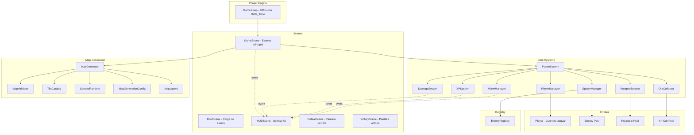
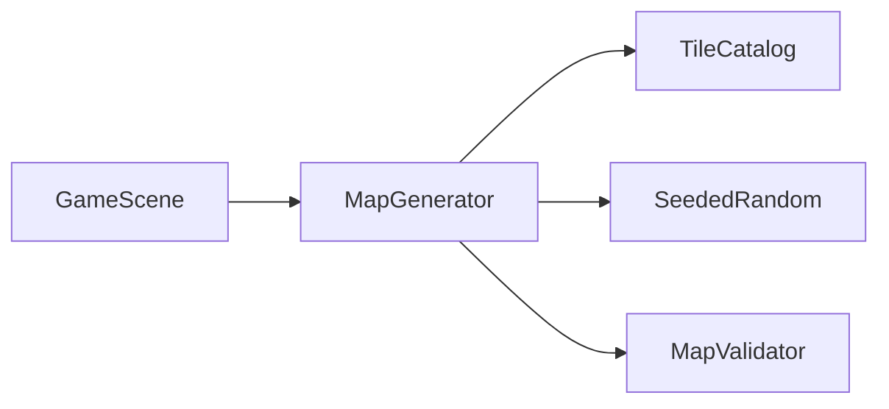
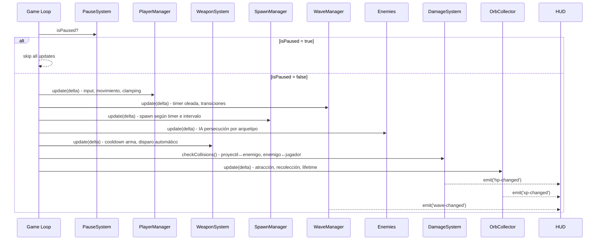
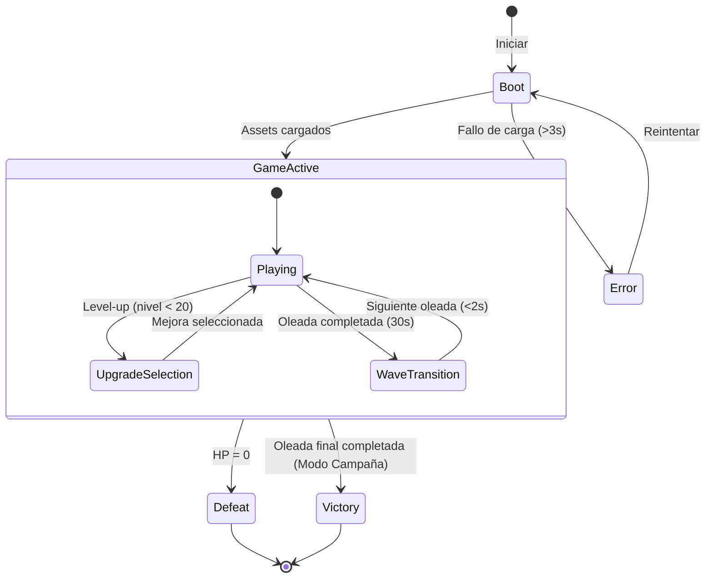
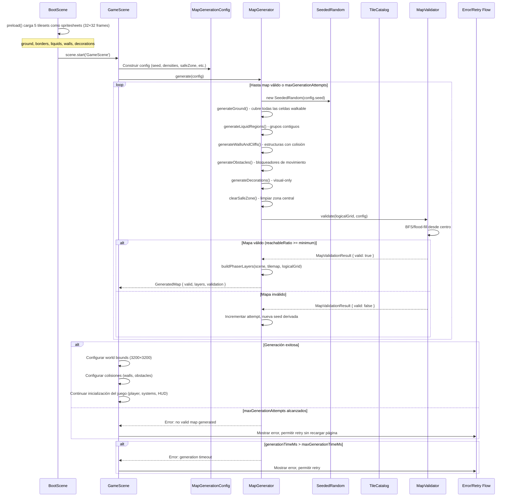

# Design Document: Mictlán Survivor Core

## Overview

Este diseño define la arquitectura técnica del núcleo de mecánicas survivor para "Mictlán - El honor del guerrero jaguar". El sistema implementa un game loop basado en Phaser 3, movimiento 8-direccional con cancelación de ejes independiente, spawn de enemigos con IA de persecución (incluyendo comportamientos especiales por arquetipo), combate automático por proyectiles, progresión XP dual (levelXp / totalXp) con selección de mejoras, oleadas con dificultad exponencial escalable, HUD reactivo, recolección de orbes con atracción magnética, y soporte para Modo Campaña y Modo Infinito.

El juego se construye sobre **Phaser 3** (motor 2D), **TypeScript** (tipado estático), y **Vite** (bundler/HMR). La arquitectura sigue el patrón Scene-based de Phaser con sistemas modulares desacoplados que se comunican mediante eventos. **Todos los cálculos dependientes del tiempo usan Delta_Time** para garantizar independencia de frame rate.

### Decisiones de Diseño Clave

1. **ECS-lite sobre Phaser Scenes**: Usamos GameObjects de Phaser pero con lógica separada en sistemas (SpawnManager, DamageSystem, WaveManager, etc.) para mantener responsabilidad única.
2. **Evento-driven para HUD**: El HUD escucha eventos del EventEmitter de Phaser en lugar de polling, garantizando actualizaciones en el mismo frame.
3. **Object Pooling**: Proyectiles y orbes usan pools para evitar garbage collection spikes y mantener 60fps estables.
4. **EnemyRegistry pattern**: Permite añadir nuevos tipos de enemigos sin modificar código existente (Open/Closed Principle).
5. **Configuración por datos**: Oleadas, enemigos y armas se definen en objetos de configuración tipados, no hardcodeados.
6. **Pausa completa durante upgrades**: Un flag global `isPaused` congela TODOS los sistemas simultáneamente.
7. **XP dual**: `levelXp` (progreso del nivel actual) y `totalXp` (acumulado total de partida) son contadores separados.
8. **Escalado exponencial**: Las fórmulas de dificultad usan exponentes (0.9^n, 1.15^n, 1.05^n) con topes máximos/mínimos.

## Architecture



### Dependencias del Sistema de Generación de Mapa



- **GameScene** coordina la creación del mapa: construye `MapGenerationConfig`, invoca `MapGenerator.generate()`, y reacciona al resultado (éxito → configurar world bounds y colisiones; fallo → mostrar error/retry).
- **GameScene NO contiene** el algoritmo procedural directamente. Toda la lógica de generación reside en `MapGenerator`.
- **MapGenerator** es el orquestador de generación: usa `TileCatalog` para resolver referencias de tiles, `SeededRandom` para decisiones aleatorias deterministas, y `MapValidator` para verificar accesibilidad.
- **TileCatalog** es puro/estático: no depende de estado de runtime.

### Flujo del Game Loop (cada frame)



### Diagrama de Estados del Juego



### Modos de Juego

- **Modo Campaña**: Tiene un `finalWave` configurado (e.g., 10). Al completar esa oleada, se muestra pantalla de Victoria.
- **Modo Infinito**: `finalWave: null`. Las oleadas continúan indefinidamente; cuando se supera la última oleada configurada, se repiten sus parámetros SIN escalado de dificultad adicional.

### Flujo de Creación del Mapa en GameScene



**Notas del flujo**:
- BootScene carga los 5 tilesets como spritesheets con `frameWidth: 32, frameHeight: 32`, NO como imágenes completas (TileSprite).
- GameScene es el coordinador pero NO contiene el algoritmo de generación; delega completamente a MapGenerator.
- Si la validación falla, MapGenerator deriva una nueva seed (e.g., `hash(originalSeed + attempt)`) para el siguiente intento.
- El timeout de 3s cubre todo el ciclo: generación + validación de todos los intentos.
- En caso de fallo final, el usuario puede reintentar sin recargar la página (se re-invoca `generate()` con nueva config/seed).

## Components and Interfaces

### Scene Layer

```typescript
// BootScene: carga assets, transiciona a GameScene
class BootScene extends Phaser.Scene {
  preload(): void;  // carga sprites, audio
  create(): void;   // transiciona a GameScene al completar
}

// GameScene: escena principal de juego
class GameScene extends Phaser.Scene {
  private player: Player;
  private pauseSystem: PauseSystem;
  private spawnManager: SpawnManager;
  private waveManager: WaveManager;
  private damageSystem: DamageSystem;
  private xpSystem: XPSystem;
  private weaponSystem: WeaponSystem;
  private orbCollector: OrbCollector;
  private gameMode: GameModeConfig;

  create(): void;
  update(time: number, delta: number): void;  // delega a sistemas si !isPaused
}

// HUDScene: overlay paralelo a GameScene
class HUDScene extends Phaser.Scene {
  private healthBar: HealthBar;
  private xpBar: XPBar;
  private waveDisplay: WaveDisplay;
  private timerDisplay: TimerDisplay;
  private levelUpPanel: LevelUpPanel;

  create(): void;   // bindea event listeners
}

// DefeatScene: muestra stats de derrota
class DefeatScene extends Phaser.Scene {
  // Muestra: tiempo supervivencia, XP total
}

// VictoryScene: muestra stats de victoria (solo Modo Campaña)
class VictoryScene extends Phaser.Scene {
  // Muestra: tiempo total, oleada máxima, enemigos derrotados, XP total, nivel
}
```

### PauseSystem

**Responsabilidad**: Controlar la pausa global durante la selección de mejoras.

**Requisitos que satisface**: 5.4, 5.5, 5.9, 5.10, 5.11

```typescript
class PauseSystem {
  private _isPaused: boolean = false;

  get isPaused(): boolean;

  /**
   * Pausa TODOS los sistemas: movimiento jugador, enemigos, proyectiles,
   * armas+cooldowns, físicas+colisiones, daño, spawns, timer oleada,
   * timer supervivencia, movimiento y recolección de orbes.
   */
  pause(): void;

  /**
   * Reanuda todos los sistemas desde el estado anterior a la pausa.
   */
  resume(): void;
}
```

### Entity Layer

```typescript
class Player extends Phaser.Physics.Arcade.Sprite {
  hp: number;
  maxHp: number;
  level: number;
  levelXp: number;       // XP acumulada en el nivel actual
  totalXp: number;       // XP total de la partida
  xpThreshold: number;   // nivel_actual * 10 + 5
  speed: number;         // 200 px/s base

  move(direction: Phaser.Math.Vector2, delta: number): void;
  takeDamage(amount: number): void;
  heal(amount: number): void;
  addXP(value: number): LevelUpResult;
}

interface LevelUpResult {
  leveledUp: boolean;
  newLevel: number;
  excessXp: number;
  reachedMaxLevel: boolean;  // true si newLevel >= 20
}
```

### Enemy Hierarchy

```typescript
interface IEnemy {
  hp: number;
  maxHp: number;
  speed: number;
  damage: number;
  xpReward: number;
  update(delta: number, playerPos: Phaser.Math.Vector2): void;
  takeDamage(amount: number): void;
  onDefeat(): void;
}

abstract class Enemy extends Phaser.Physics.Arcade.Sprite implements IEnemy {
  abstract hp: number;
  abstract maxHp: number;
  abstract speed: number;
  abstract damage: number;
  abstract xpReward: number;

  abstract update(delta: number, playerPos: Phaser.Math.Vector2): void;
  takeDamage(amount: number): void;
  onDefeat(): void;  // emite evento, spawna orbe
}

// Esqueleto: persecución directa
class Esqueleto extends Enemy {
  hp = 30; speed = 80; damage = 5; xpReward = 5;
  update(delta, playerPos): void;  // dirección directa a playerPos
}

// Murciélago: persecución con zigzag perpendicular a dirección de avance
class Murcielago extends Enemy {
  hp = 15; speed = 150; damage = 3; xpReward = 3;
  private zigzagPhase: number;
  private zigzagAmplitude: number;
  update(delta, playerPos): void;  // oscilación perpendicular al vector de avance
}

// Calavera Llameante: persecución directa + explosión al morir
class CalaveraLlameante extends Enemy {
  hp = 50; speed = 60; damage = 10; xpReward = 10;
  private explosionRadius = 100;  // px
  private explosionDamage = 15;
  update(delta, playerPos): void;  // persecución directa
  onDefeat(): void;  // explota: 15 daño al jugador si está dentro de 100px
}

// Serpiente Emplumada: persecución con aceleración progresiva
class SerpienteEmplumada extends Enemy {
  hp = 80; speed = 100; damage = 8; xpReward = 15;
  private currentSpeed: number;
  private acceleration: number;
  private maxSpeed: number;  // configurable
  update(delta, playerPos): void;  // acelera progresivamente hasta maxSpeed
}
```

### System Layer

#### PlayerManager

**Responsabilidad**: Procesar input de teclado, calcular dirección con cancelación de ejes independiente, normalizar vectores diagonales, aplicar movimiento con delta time, clampar posición a límites del mapa.

**Requisitos que satisface**: 2.1, 2.2, 2.3, 2.4, 2.5, 2.6

```typescript
class PlayerManager {
  private player: Player;
  private cursors: Phaser.Types.Input.Keyboard.CursorKeys;
  private wasd: { W, A, S, D };

  /**
   * Calcula dirección: teclas opuestas en un eje se cancelan solo en ese eje.
   * W+S+D → (1, 0); A+D sin vertical → (0, 0)
   * Normaliza diagonal para mantener magnitud = speed.
   * Aplica delta time al desplazamiento.
   * Clampa posición final a [0, 3200]×[0, 3200].
   */
  update(delta: number): void;

  private calculateDirection(): Phaser.Math.Vector2;
}
```

#### SpawnManager

**Responsabilidad**: Generar enemigos según configuración de oleada, validando 3 condiciones simultáneas de posición. Eliminar enemigos lejanos (>1500px). Respetar cap de maxEnemies configurable por oleada.

**Requisitos que satisface**: 3.1, 3.2, 3.5, 3.6, 3.7

```typescript
class SpawnManager {
  private enemyPool: Phaser.GameObjects.Group;
  private spawnTimer: number;         // acumula delta time
  private spawnInterval: number;      // configurable por oleada
  private maxEnemies: number;         // configurable por oleada, default 100
  private despawnDistance: number;     // 1500px

  update(delta: number): void;
  setWaveConfig(config: WaveConfig): void;
  getActiveEnemyCount(): number;

  /**
   * Genera posición que cumple 3 condiciones simultáneas:
   * 1. Fuera del viewport de la cámara
   * 2. Dentro de límites del mapa (3200×3200)
   * 3. Entre 50 y 300px del borde visible de la cámara
   * 
   * Si no existe posición válida → retorna null (cancela spawn,
   * reintenta en siguiente intervalo).
   */
  private findValidSpawnPosition(camera: Phaser.Cameras.Scene2D.Camera): Phaser.Math.Vector2 | null;

  /**
   * Elimina enemigos a >1500px del jugador sin otorgar XP ni orbe.
   */
  private despawnDistantEnemies(playerPos: Phaser.Math.Vector2): void;
}
```

#### WaveManager

**Responsabilidad**: Controlar duración de oleadas (30s), transiciones (<2s), calcular escalado de dificultad con fórmulas exponenciales, determinar condición de victoria (Campaña) o continuación infinita.

**Requisitos que satisface**: 6.1, 6.2, 6.3, 6.4, 6.5

```typescript
class WaveManager {
  private currentWave: number;
  private waveTimer: number;           // acumula delta time
  private waveDuration: number;        // 30s
  private transitionTimer: number;
  private gameMode: GameModeConfig;
  private waveConfigs: WaveConfig[];   // configuraciones predefinidas

  update(delta: number): void;
  getCurrentWave(): number;
  getWaveConfig(): WaveConfig;

  /**
   * Fórmulas de escalado exponencial:
   * spawnInterval = max(baseSpawnInterval × 0.9^(wave-1), 0.5)
   * hpMultiplier = min(1.15^(wave-1), 5)
   * speedMultiplier = min(1.05^(wave-1), 2)
   */
  calculateDifficulty(wave: number): DifficultyParams;

  /**
   * Campaña: retorna true si currentWave > finalWave
   * Infinito: siempre false
   */
  isVictory(): boolean;

  /**
   * Para modo infinito: si wave > últimaOleadaConfigurada,
   * repite parámetros de la última sin escalado adicional.
   */
  private resolveWaveConfig(wave: number): WaveConfig;
}
```

#### DamageSystem

**Responsabilidad**: Detectar colisiones proyectil↔enemigo y enemigo↔jugador. Aplicar daño con cooldown de contacto (1000ms por enemigo). Gestionar explosión de Calavera Llameante al morir. Emitir eventos de cambio de HP.

**Requisitos que satisface**: 4.1, 4.2, 4.3, 4.4, 4.5, 9.1 (explosión Calavera)

```typescript
class DamageSystem {
  private contactCooldowns: Map<string, number>;  // enemyId → lastDamageTime
  private contactCooldownMs: number;  // 1000ms

  checkProjectileEnemyCollisions(): void;
  checkEnemyPlayerCollisions(delta: number): void;

  /**
   * Al destruir Calavera Llameante: si jugador está a ≤100px,
   * aplicar 15 de daño al jugador.
   */
  handleEnemyDefeat(enemy: Enemy, playerPos: Phaser.Math.Vector2): void;
}
```

#### XPSystem

**Responsabilidad**: Gestionar XP dual (levelXp y totalXp). Calcular umbrales. Ejecutar lógica de level-up con carry-over de exceso. Determinar cuándo mostrar panel de mejoras (nivel < 20, pool no vacío). Manejar nivel 20 (stop level, continue totalXp).

**Requisitos que satisface**: 5.1, 5.2, 5.6, 5.7, 5.9, 5.10, 5.11, 8.3, 8.6

```typescript
class XPSystem {
  private upgradePool: Upgrade[];

  /**
   * Fórmula: nivel_actual × 10 + 5
   */
  calculateThreshold(level: number): number;

  /**
   * Incrementa levelXp y totalXp por value.
   * Si level = 20: solo incrementa totalXp, levelXp se mantiene en threshold.
   * Si levelXp >= threshold y level < 20:
   *   - level++
   *   - levelXp -= threshold (exceso se conserva)
   *   - Si level < 20 Y upgradePool no vacío: pausa + panel
   *   - Si level = 20 O upgradePool vacío: NO pausa, NO panel
   */
  addXP(player: Player, value: number): LevelUpResult;

  /**
   * Retorna min(3, pool.length) upgrades únicos aleatorios.
   * Si pool vacío: retorna array vacío (no se muestra panel).
   */
  getRandomUpgrades(count: number): Upgrade[];

  applyUpgrade(player: Player, upgrade: Upgrade): void;
  removeUpgradeFromPool(upgradeId: string): void;
}
```

#### WeaponSystem

**Responsabilidad**: Disparar automáticamente al enemigo más cercano dentro de 800px. Manejar cooldown del arma con delta time. Gestionar pool de proyectiles. Destruir proyectiles a 1000px de distancia recorrida.

**Requisitos que satisface**: 4.1, 4.6

```typescript
class WeaponSystem {
  private fireRate: number;          // base: 1000ms
  private fireTimer: number;         // acumula delta time
  private projectilePool: Phaser.GameObjects.Group;
  private range: number;             // 800px
  private damage: number;            // base: 10
  private projectileSpeed: number;
  private maxProjectileDistance: number;  // 1000px

  update(delta: number, playerPos: Phaser.Math.Vector2, enemies: Enemy[]): void;

  /**
   * Encuentra el enemigo con menor distancia euclidiana al jugador,
   * siempre que esté dentro de range (800px).
   * Si ninguno está en rango, retorna null (no dispara).
   */
  findClosestEnemy(playerPos: Phaser.Math.Vector2, enemies: Enemy[]): Enemy | null;

  private fireProjectile(from: Phaser.Math.Vector2, target: Enemy): void;
  private updateProjectiles(delta: number): void;
}
```

#### OrbCollector

**Responsabilidad**: Gestionar pool de orbes de XP. Aplicar atracción magnética (≤100px → 400px/s hacia jugador). Detectar colisión para recolección. Gestionar lifetime (30s). Respetar cap de 200 orbes (FIFO para eliminación). Durante pausa: NO mover ni recolectar orbes.

**Requisitos que satisface**: 8.1, 8.2, 8.3, 8.4, 8.5, 8.6

```typescript
class OrbCollector {
  private orbPool: Phaser.GameObjects.Group;
  private attractRadius: number;     // 100px
  private attractSpeed: number;      // 400 px/s
  private maxOrbs: number;           // 200
  private orbLifetime: number;       // 30s
  private orbTimestamps: Map<string, number>;  // orbId → creationTime

  spawnOrb(position: Phaser.Math.Vector2, value: number): void;
  update(delta: number, playerPos: Phaser.Math.Vector2): void;

  private attractOrb(orb: XPOrb, playerPos: Phaser.Math.Vector2, delta: number): void;
  private collectOrb(orb: XPOrb): void;
  private removeExpiredOrbs(currentTime: number): void;
  private enforceOrbCap(): void;  // elimina más antiguos si > 200
}
```

#### EnemyRegistry

**Responsabilidad**: Registrar factories de enemigos por tipo. Crear instancias sin acoplar SpawnManager a implementaciones concretas. Permitir extensibilidad (Open/Closed).

**Requisitos que satisface**: 9.2, 9.5

```typescript
type EnemyFactory = (scene: Phaser.Scene, x: number, y: number, config: EnemySpawnConfig) => Enemy;

class EnemyRegistry {
  private registry: Map<string, EnemyFactory>;

  register(type: string, factory: EnemyFactory): void;
  create(type: string, scene: Phaser.Scene, x: number, y: number, config: EnemySpawnConfig): Enemy;
  getRegisteredTypes(): string[];
  has(type: string): boolean;
}
```

#### HUD Components

**Responsabilidad**: Mostrar información de estado en tiempo real. Actualizar en el mismo frame vía eventos. Gestionar panel de selección de mejoras.

**Requisitos que satisface**: 7.1, 7.2, 7.3, 7.4, 7.5, 7.6, 5.3, 5.8

```typescript
class HealthBar {
  /** fillRatio = hp / maxHp, clamped [0, 1] */
  update(hp: number, maxHp: number): void;
}

class XPBar {
  /**
   * fillRatio = levelXp / threshold, clamped [0, 1].
   * Tras level-up: muestra excessXp / newThreshold × 100%.
   * En nivel 20: permanece a 100%.
   */
  update(levelXp: number, threshold: number, isMaxLevel: boolean): void;
}

class WaveDisplay {
  update(waveNumber: number): void;
  showWaveAnnouncement(waveNumber: number): void;
}

class TimerDisplay {
  /** Formato MM:SS. MM = floor(s/60) pad 2, SS = (s%60) pad 2 */
  update(elapsedSeconds: number): void;
}

class LevelUpPanel {
  show(upgrades: Upgrade[]): void;
  hide(): void;
  onSelect: (upgrade: Upgrade) => void;
}
```

## Data Models

### Configuración de Modos de Juego

```typescript
interface GameModeConfig {
  mode: 'campaign' | 'infinite';
  finalWave: number | null;  // null para modo infinito
}
```

### Configuración de Oleadas

```typescript
interface WaveConfig {
  waveNumber: number;
  duration: number;            // 30 seconds
  spawnInterval: number;       // calculado por fórmula exponencial
  maxEnemies: number;          // configurable por oleada, default 100
  enemyTypes: EnemyTypeWeight[];
  hpMultiplier: number;        // calculado: min(1.15^(wave-1), 5)
  speedMultiplier: number;     // calculado: min(1.05^(wave-1), 2)
}

interface EnemyTypeWeight {
  type: string;       // key en EnemyRegistry
  weight: number;     // probabilidad relativa
}

interface DifficultyParams {
  spawnInterval: number;    // max(2 × 0.9^(wave-1), 0.5)
  hpMultiplier: number;     // min(1.15^(wave-1), 5)
  speedMultiplier: number;  // min(1.05^(wave-1), 2)
}
```

### Configuración de Enemigos

```typescript
interface EnemyConfig {
  key: string;
  hp: number;
  speed: number;          // px/s (base, antes de multiplicador)
  damage: number;
  xpReward: number;
  spriteKey: string;
  behavior: EnemyBehaviorConfig;
}

type EnemyBehaviorConfig =
  | { type: 'direct_chase' }
  | { type: 'zigzag_chase'; amplitude: number; frequency: number }
  | { type: 'explode_on_death'; explosionRadius: number; explosionDamage: number }
  | { type: 'accelerating_chase'; acceleration: number; maxSpeed: number };

interface EnemySpawnConfig {
  hpMultiplier: number;
  speedMultiplier: number;
}
```

### Estado del Jugador

```typescript
interface PlayerState {
  hp: number;
  maxHp: number;           // base: 100
  level: number;           // 1-20
  levelXp: number;         // XP acumulada en nivel actual
  totalXp: number;         // XP total de toda la partida
  xpThreshold: number;     // nivel_actual × 10 + 5
  speed: number;           // base: 200 px/s
  weapon: WeaponConfig;
  upgrades: Upgrade[];
}

interface WeaponConfig {
  damage: number;           // base: 10
  fireRate: number;         // base: 1000ms
  range: number;            // base: 800px
  projectileSpeed: number;
  maxDistance: number;       // 1000px antes de destruirse
}
```

### Sistema de Mejoras

```typescript
interface Upgrade {
  id: string;
  name: string;
  description: string;
  apply(player: Player): void;
}

type UpgradePool = Upgrade[];
```

### Configuración del Mapa y Generación Procedural

```typescript
// ─── MapGenerationConfig ───
interface MapGenerationConfig {
  widthInTiles: number;            // default: 100
  heightInTiles: number;           // default: 100
  tileSize: number;                // default: 32
  seed: string | number;
  safeZoneRadius: number;          // default: 5 (tiles)
  minimumReachableRatio: number;   // default: 0.85
  wallDensity: number;             // configurable balance parameter [0, 1)
  obstacleDensity: number;         // configurable balance parameter [0, 1)
  liquidDensity: number;           // configurable balance parameter [0, 1)
  decorationDensity: number;       // configurable balance parameter [0, 1)
  maxGenerationAttempts: number;   // default: 5
  maxGenerationTimeMs: number;     // default: 3000
}

// Computed from config:
// worldWidth = widthInTiles * tileSize = 100 * 32 = 3200
// worldHeight = heightInTiles * tileSize = 100 * 32 = 3200
```

```typescript
// ─── TileCatalog ───
type TilesetKey = 'ground' | 'borders' | 'liquids' | 'walls' | 'decorations';

interface TileReference {
  tileset: TilesetKey;
  frame: number;
}

/**
 * Clasifica TODOS los frames de los 5 tilesets por su función.
 * Evita que GameScene o MapGenerator contengan frame numbers dispersos.
 * Cada frame se identifica por su tileset + índice dentro del spritesheet.
 */
interface TileCatalogDefinition {
  groundBase: TileReference[];           // tiles de suelo principal (siempre walkable)
  groundVariations: TileReference[];     // variaciones visuales de suelo
  liquidCenters: TileReference[];        // centros de regiones líquidas
  liquidEdges: TileReference[];          // bordes de transición líquido-suelo
  borders: TileReference[];             // transiciones visuales entre capas
  wallTops: TileReference[];            // parte superior de muros
  wallSides: TileReference[];           // laterales de muros
  wallCorners: TileReference[];         // esquinas de muros
  cliffs: TileReference[];             // acantilados
  obstacles: TileReference[];           // bloqueadores de movimiento
  decorations: TileReference[];         // elementos visuales sin colisión
  emptyOrTransparent: TileReference[];  // tiles vacíos/transparentes (NUNCA usar en Ground)
}

class TileCatalog {
  private catalog: TileCatalogDefinition;

  constructor(definition: TileCatalogDefinition);

  /** Obtiene tiles válidos para la capa Ground */
  getGroundTiles(): TileReference[];

  /** Obtiene tiles por categoría */
  getByCategory(category: keyof TileCatalogDefinition): TileReference[];

  /** Valida que un TileReference pertenezca a una categoría permitida */
  isPermittedForLayer(ref: TileReference, layer: MapLayerName): boolean;

  /** Verifica que un tile NO sea emptyOrTransparent */
  isValidGroundTile(ref: TileReference): boolean;

  /** Retorna todas las categorías permitidas para una capa */
  getPermittedCategories(layer: MapLayerName): (keyof TileCatalogDefinition)[];

  /**
   * Modo debug: genera lista de todos los frames con su índice,
   * textura y clasificación para validación visual.
   */
  debugListAllFrames(): DebugTileInfo[];
}

type MapLayerName = 'ground' | 'liquids' | 'borders' | 'walls' | 'obstacles' | 'decorations';

interface DebugTileInfo {
  tileset: TilesetKey;
  frame: number;
  category: keyof TileCatalogDefinition;
  description?: string;
}
```

```typescript
// ─── MapLayers ───
interface MapLayers {
  ground: Phaser.Tilemaps.TilemapLayer;      // Cubre TODAS las celdas walkable
  liquids: Phaser.Tilemaps.TilemapLayer;     // Regiones líquidas contiguas
  borders: Phaser.Tilemaps.TilemapLayer;     // Transiciones visuales
  walls: Phaser.Tilemaps.TilemapLayer;       // Estructuras CON colisión
  obstacles: Phaser.Tilemaps.TilemapLayer;   // Bloqueadores CON colisión
  decorations: Phaser.Tilemaps.TilemapLayer; // Visual-only, SIN colisión
}

/**
 * Responsabilidades por capa:
 * - Ground: cubre todas las celdas transitables. No usa emptyOrTransparent.
 * - Liquids: forman regiones contiguas. Behavior configurable per-type.
 * - Borders: transiciones visuales. No son sustituto del suelo base.
 * - Walls: estructuras con collision body. Bloquean jugador y enemigos.
 * - Obstacles: bloqueadores con collision body. Bloquean jugador y enemigos.
 * - Decorations: sin collision. Puramente visuales.
 *
 * Colisiones:
 * - Solo Walls y Obstacles aplican colisión por defecto.
 * - Liquids aplican colisión SOLO si su LiquidConfig.behavior === 'blocking'.
 *
 * PENDING DECISION: Colisiones proyectil-muro NO implementadas hasta que
 * los requisitos lo definan explícitamente. Registrado como decisión pendiente.
 */
```

```typescript
// ─── Liquid Behavior ───
type LiquidBehavior = 'walkable' | 'blocking' | 'damaging';

interface LiquidConfig {
  type: string;                  // e.g., 'lava', 'water', 'poison'
  behavior: LiquidBehavior;
  damagePerSecond?: number;      // solo aplica si behavior === 'damaging'
}

/**
 * PENDING BALANCE DECISION: Los valores concretos de damagePerSecond por tipo
 * de líquido no están definidos en los requisitos. Se dejan como configurables.
 * El sistema soporta la mecánica pero los valores numéricos se ajustarán
 * durante la fase de balanceo.
 */
```

```typescript
// ─── SeededRandom ───
class SeededRandom {
  private state: number;

  constructor(seed: string | number);

  /** Retorna float en [0, 1) - determinista */
  next(): number;

  /** Retorna entero en [min, max] inclusive */
  integer(min: number, max: number): number;

  /** Selecciona un elemento aleatorio del array */
  pick<T>(items: readonly T[]): T;

  /** Selecciona con peso - items con mayor weight tienen más probabilidad */
  weightedPick<T>(items: WeightedItem<T>[]): T;

  /** Retorna boolean con probabilidad p */
  chance(p: number): boolean;

  /** Shuffle determinista (Fisher-Yates con seed) */
  shuffle<T>(items: T[]): T[];
}

interface WeightedItem<T> {
  item: T;
  weight: number;
}

/**
 * INVARIANTE: Misma seed + misma secuencia de llamadas = mismos resultados.
 * MapGenerator NUNCA debe usar Math.random(). Solo SeededRandom.
 */
```

```typescript
// ─── MapGenerator ───
class MapGenerator {
  private tileCatalog: TileCatalog;
  private validator: MapValidator;

  constructor(tileCatalog: TileCatalog, validator: MapValidator);

  /**
   * Genera un mapa completo. Reintenta con nuevas seeds si la validación falla.
   * Retorna GeneratedMap con validation.valid === true, o error si se agotan intentos/tiempo.
   */
  generate(config: MapGenerationConfig): GeneratedMap;

  /** Fase 1: Llena toda la grid con tiles de suelo válidos (nunca transparentes) */
  private generateGround(grid: MapCell[][], rng: SeededRandom): void;

  /** Fase 2: Coloca regiones de líquido como grupos contiguos */
  private generateLiquidRegions(grid: MapCell[][], rng: SeededRandom, config: MapGenerationConfig): void;

  /** Fase 3: Genera muros y acantilados usando reglas/templates */
  private generateWallsAndCliffs(grid: MapCell[][], rng: SeededRandom, config: MapGenerationConfig): void;

  /** Fase 4: Coloca obstáculos respetando reglas de path */
  private generateObstacles(grid: MapCell[][], rng: SeededRandom, config: MapGenerationConfig): void;

  /** Fase 5: Añade decoraciones (visual-only, no bloquean) */
  private generateDecorations(grid: MapCell[][], rng: SeededRandom, config: MapGenerationConfig): void;

  /** Fase 6: Limpia la zona central segura de todo elemento bloqueante */
  private clearSafeZone(grid: MapCell[][], config: MapGenerationConfig): void;

  /** Convierte la representación lógica en capas de Phaser Tilemap */
  private buildPhaserLayers(scene: Phaser.Scene, grid: MapCell[][]): MapLayers;
}

/**
 * Algoritmo de generación (reglas configurables, NO Wave Function Collapse):
 *
 * 1. Ground: Llenar 100% de celdas con groundBase + variaciones aleatorias.
 * 2. Liquids: Seleccionar N puntos semilla aleatorios, expandir con flood-fill
 *    limitado por liquidDensity. Garantiza contiguidad.
 * 3. Walls/Cliffs: Usar generación por chunks/templates o reglas de vecindad.
 *    Formar estructuras coherentes (no placement puramente aleatorio).
 *    Respetar wallDensity como porcentaje máximo de tiles.
 * 4. Obstacles: Colocar en celdas walkable que no sean safeZone.
 *    Respetar obstacleDensity. Evitar bloquear paths principales.
 * 5. Decorations: Colocar en celdas walkable sin obstáculos.
 *    Respetar decorationDensity. No bloquean nada.
 * 6. Safe Zone: Forzar limpieza de radio safeZoneRadius desde centro.
 *    Eliminar walls, obstacles, blocking liquids del área.
 *
 * RESTRICCIONES:
 * - NO usar Math.random() — solo SeededRandom.
 * - NO colocar tiles transparentes/vacíos en la capa Ground.
 * - NO generar líquidos como tiles aislados (deben ser contiguos).
 * - NO usar placement puramente aleatorio sin estructura para walls.
 * - Cada tile referenciado debe existir en TileCatalog para su capa.
 * - Decoraciones NO deben bloquear paths principales.
 * - Permitir regeneración si validación falla (nueva seed derivada).
 */
```

```typescript
// ─── MapValidator ───
interface MapValidationResult {
  valid: boolean;
  reachableTiles: number;
  totalWalkableTiles: number;
  reachableRatio: number;         // reachableTiles / totalWalkableTiles
  errors: MapValidationError[];
}

interface MapValidationError {
  code: string;                    // e.g., 'CENTER_NOT_WALKABLE', 'LOW_REACHABILITY'
  message: string;
  details?: Record<string, unknown>;
}

class MapValidator {
  /**
   * Valida un mapa lógico usando BFS/flood-fill.
   *
   * Checks:
   * 1. Centro (50, 50) es walkable.
   * 2. Safe zone (radio configurable) no contiene walls, obstacles, ni liquids blocking.
   * 3. Al menos minimumReachableRatio de celdas walkable son accesibles desde centro.
   * 4. Jugador no está encerrado (reachableTiles > 1).
   *
   * El resultado se emite ANTES de construir las capas Phaser.
   * Un mapa inválido nunca llega a buildPhaserLayers().
   */
  validate(grid: MapCell[][], config: MapGenerationConfig): MapValidationResult;

  /** BFS desde punto central, cuenta celdas walkable alcanzables */
  private floodFill(grid: MapCell[][], startX: number, startY: number): number;

  /** Verifica que la safe zone esté completamente libre */
  private validateSafeZone(grid: MapCell[][], centerX: number, centerY: number, radius: number): MapValidationError[];
}
```

```typescript
// ─── GeneratedMap ───
interface GeneratedMap {
  seed: string | number;
  widthInTiles: number;            // siempre 100
  heightInTiles: number;           // siempre 100
  logicalGrid: MapCell[][];        // representación lógica [100][100]
  layers: MapLayers | null;        // null si generación falló
  validation: MapValidationResult;
  generationTimeMs: number;        // tiempo total de generación+validación
  attempts: number;                // intentos realizados
  error?: MapGenerationError;      // presente solo si generación falló
}

/**
 * Tipos de celda en el mapa lógico.
 * Diferencia al mínimo: walkable, liquid, blocking, decoration, safeZone.
 */
interface MapCell {
  walkable: boolean;               // true si jugador/enemigos pueden atravesar
  ground: TileReference | null;    // tile de suelo (nunca null en celdas walkable)
  liquid: TileReference | null;    // tile de líquido (si aplica)
  liquidConfig: LiquidConfig | null;
  wall: TileReference | null;      // tile de muro (implica walkable=false)
  obstacle: TileReference | null;  // tile de obstáculo (implica walkable=false)
  decoration: TileReference | null; // tile decorativo (no afecta walkable)
  border: TileReference | null;    // tile de transición visual
  inSafeZone: boolean;            // true si está dentro del radio seguro
}

interface MapGenerationError {
  code: 'MAX_ATTEMPTS_REACHED' | 'GENERATION_TIMEOUT' | 'MISSING_TILESET' |
        'INCOMPLETE_CATALOG' | 'EMPTY_GROUND_TILE_USED' | 'LAYER_CREATION_FAILED';
  message: string;
  attempts: number;
  elapsedMs: number;
  lastValidation?: MapValidationResult;
}
```

### Profundidad Visual y Colisiones de Capas

```typescript
/**
 * Orden de renderizado (depth) — de menor a mayor:
 *
 * 1. Ground Layer (depth: 0)
 * 2. Liquids Layer (depth: 1)
 * 3. Borders Layer (depth: 2)
 * 4. Lower Decorations (depth: 3)   — decoraciones bajo el jugador
 * 5. Walls & Obstacles (depth: 4)
 * 6. Player & Enemies (depth: 5)
 * 7. Upper Decorations (depth: 6)   — decoraciones sobre el jugador
 * 8. HUDScene (overlay scene, renderizada encima de todo)
 *
 * Colisiones por capa:
 * - Ground: NO collision
 * - Liquids: per LiquidConfig.behavior ('blocking' → collision; otros → no)
 * - Borders: NO collision (visual only)
 * - Walls: SÍ collision (bloquean jugador y enemigos)
 * - Obstacles: SÍ collision (bloquean jugador y enemigos)
 * - Decorations: NO collision
 *
 * PENDING DECISION: Colisiones proyectil↔muro NO implementadas.
 * Los requisitos actuales no definen este comportamiento.
 * Se registra como decisión pendiente de diseño de gameplay.
 */

const MAP_LAYER_DEPTHS = {
  ground: 0,
  liquids: 1,
  borders: 2,
  lowerDecorations: 3,
  walls: 4,
  obstacles: 4,
  player: 5,
  enemies: 5,
  upperDecorations: 6,
} as const;
```

### Escalado de Dificultad (Fórmulas Exponenciales)

```typescript
/**
 * Fórmulas de escalado exponencial por oleada:
 *
 * spawnInterval = max(baseSpawnInterval × 0.9^(wave - 1), 0.5)
 *   → Reducción acumulativa del 10% por oleada, mínimo 0.5s
 *
 * hpMultiplier = min(1.15^(wave - 1), 5)
 *   → Incremento del 15% compuesto por oleada, máximo 5x
 *
 * speedMultiplier = min(1.05^(wave - 1), 2)
 *   → Incremento del 5% compuesto por oleada, máximo 2x
 */
function calculateDifficulty(wave: number, baseSpawnInterval: number = 2): DifficultyParams {
  return {
    spawnInterval: Math.max(baseSpawnInterval * Math.pow(0.9, wave - 1), 0.5),
    hpMultiplier: Math.min(Math.pow(1.15, wave - 1), 5),
    speedMultiplier: Math.min(Math.pow(1.05, wave - 1), 2),
  };
}
```

### Progresión de Enemigos por Oleada

```typescript
const WAVE_ENEMY_PROGRESSION: Record<number, string[]> = {
  // Oleadas 1-3: solo Esqueletos
  1: ['esqueleto'], 2: ['esqueleto'], 3: ['esqueleto'],
  // Oleadas 4-6: Esqueletos + Murciélagos
  4: ['esqueleto', 'murcielago'], 5: ['esqueleto', 'murcielago'], 6: ['esqueleto', 'murcielago'],
  // Oleadas 7-8: + Calavera Llameante
  7: ['esqueleto', 'murcielago', 'calavera_llameante'], 8: ['esqueleto', 'murcielago', 'calavera_llameante'],
  // Oleadas 9-10: los 4 tipos
  9: ['esqueleto', 'murcielago', 'calavera_llameante', 'serpiente_emplumada'],
  10: ['esqueleto', 'murcielago', 'calavera_llameante', 'serpiente_emplumada'],
};
```

### Constantes del Juego

```typescript
const GAME_CONSTANTS = {
  // Player
  PLAYER_BASE_SPEED: 200,           // px/s
  PLAYER_BASE_HP: 100,
  MAX_LEVEL: 20,

  // Map
  MAP_WIDTH: 3200,
  MAP_HEIGHT: 3200,

  // Waves
  WAVE_DURATION: 30,                // seconds
  WAVE_TRANSITION_TIME: 2,          // seconds
  BASE_SPAWN_INTERVAL: 2,           // seconds

  // Enemies
  DEFAULT_MAX_ENEMIES: 100,         // configurable per wave
  ENEMY_DESPAWN_DISTANCE: 1500,     // px

  // Spawn positioning
  SPAWN_MIN_DISTANCE_FROM_EDGE: 50,   // px del borde visible
  SPAWN_MAX_DISTANCE_FROM_EDGE: 300,  // px del borde visible

  // Weapon
  WEAPON_BASE_DAMAGE: 10,
  WEAPON_BASE_FIRE_RATE: 1000,      // ms
  WEAPON_RANGE: 800,                // px
  PROJECTILE_MAX_DISTANCE: 1000,    // px

  // Combat
  CONTACT_DAMAGE_COOLDOWN: 1000,    // ms

  // Orbs
  ORB_ATTRACT_RADIUS: 100,          // px
  ORB_ATTRACT_SPEED: 400,           // px/s
  ORB_LIFETIME: 30,                 // seconds
  MAX_ORBS: 200,

  // XP
  XP_THRESHOLD_FORMULA: (level: number) => level * 10 + 5,

  // Difficulty scaling
  SPAWN_INTERVAL_DECAY: 0.9,        // multiplicador por oleada
  MIN_SPAWN_INTERVAL: 0.5,          // seconds (floor)
  HP_SCALING_BASE: 1.15,            // base exponencial HP
  MAX_HP_MULTIPLIER: 5,             // ceiling
  SPEED_SCALING_BASE: 1.05,         // base exponencial velocidad
  MAX_SPEED_MULTIPLIER: 2,          // ceiling

  // Calavera Llameante
  EXPLOSION_RADIUS: 100,            // px
  EXPLOSION_DAMAGE: 15,
} as const;
```

## Correctness Properties

*A property is a characteristic or behavior that should hold true across all valid executions of a system—essentially, a formal statement about what the system should do. Properties serve as the bridge between human-readable specifications and machine-verifiable correctness guarantees.*

### Property 1: Movement Speed Normalization

*For any* valid direction input (single cardinal key or diagonal combination of two non-opposing keys), the resulting velocity vector of the Guerrero_Jaguar SHALL have a magnitude exactly equal to the base speed (200 px/s), regardless of whether the movement is cardinal or diagonal.

**Validates: Requirements 2.1, 2.2**

### Property 2: Axis-Independent Opposing Key Cancellation

*For any* combination of pressed direction keys where two opposing keys are active on one axis (e.g., W+S), the movement on that axis SHALL be zero while movement on the perpendicular axis SHALL be preserved at full speed if an active key exists (e.g., W+S+D → velocity = (200, 0); A+D → velocity = (0, 0)).

**Validates: Requirements 2.6**

### Property 3: Player Boundary Clamping

*For any* player position and movement vector applied over any delta time, the resulting position SHALL always remain within the map boundaries [0, 3200] × [0, 3200] pixels.

**Validates: Requirements 2.5**

### Property 4: Spawn Position Triple Constraint

*For any* spawn event during an active wave and any camera viewport position within the map, the spawned enemy position SHALL simultaneously satisfy: (a) outside the camera viewport, (b) within map bounds [0, 3200]×[0, 3200], and (c) at a distance between 50 and 300 pixels from the nearest visible edge of the camera. If no such position exists, the spawn SHALL be cancelled.

**Validates: Requirements 3.1, 3.2**

### Property 5: Enemy Pursuit Direction

*For any* active enemy at position E and player at position P where E ≠ P, the enemy's base velocity vector SHALL point in the direction from E to P (for direct chase behaviors). The magnitude SHALL equal the enemy's configured speed multiplied by the wave's speedMultiplier.

**Validates: Requirements 3.3**

### Property 6: Enemy Defeat Produces Correctly Valued XP Orb

*For any* enemy of any type defeated at position P, the system SHALL spawn exactly one XP orb at position P with a value equal to that enemy type's configured xpReward.

**Validates: Requirements 3.4, 8.1**

### Property 7: Max Enemies Cap per Wave

*For any* game state during an active wave with configured maxEnemies = M, the count of active enemies SHALL never exceed M. The SpawnManager SHALL not generate new enemies while activeCount >= M.

**Validates: Requirements 3.5**

### Property 8: Enemy Despawn by Distance

*For any* enemy at Euclidean distance D from the Guerrero_Jaguar where D > 1500 pixels, the SpawnManager SHALL remove that enemy from the scene without awarding XP and without spawning an orb.

**Validates: Requirements 3.6**

### Property 9: Closest Enemy Targeting

*For any* set of active enemies and player position, the WeaponSystem SHALL select as target the enemy with the smallest Euclidean distance to the player, provided that distance ≤ 800 pixels. If no enemy is within 800px, no projectile SHALL be fired.

**Validates: Requirements 4.1**

### Property 10: Damage Application and Defeat Trigger

*For any* projectile-enemy collision where the enemy has HP > 0, the enemy's HP SHALL be reduced by the weapon's current damage value and the projectile SHALL be destroyed. If the resulting HP ≤ 0, the enemy SHALL be marked as defeated and trigger onDefeat().

**Validates: Requirements 4.2, 4.3**

### Property 11: Contact Damage Cooldown

*For any* enemy in continuous contact with the Guerrero_Jaguar over any time interval, damage SHALL be applied at most once per 1000 milliseconds per individual enemy, regardless of frame rate or delta time variations.

**Validates: Requirements 4.4**

### Property 12: Projectile Max Travel Distance

*For any* projectile, once it has traveled a cumulative distance ≥ 1000 pixels from its origin point without hitting an enemy, it SHALL be destroyed and removed from the scene.

**Validates: Requirements 4.6**

### Property 13: XP Dual Counter Increment

*For any* XP orb with value V collected by the Guerrero_Jaguar at level L < 20, both levelXp SHALL increase by V and totalXp SHALL increase by V. At level 20, only totalXp SHALL increase by V while levelXp remains capped at the threshold.

**Validates: Requirements 5.1, 8.3, 8.6**

### Property 14: Level-Up Excess Carry-Over

*For any* player at level L (L < 20) with current levelXp X and threshold T, when levelXp reaches or exceeds T: the level SHALL become L+1, levelXp SHALL become (X - T) (the excess), and the new threshold SHALL be (L+1) × 10 + 5. The excess is the starting progress toward the next level.

**Validates: Requirements 5.2**

### Property 15: Upgrade Selection Uniqueness and Count

*For any* level-up event where the upgrade pool contains N upgrades: if N ≥ 3, exactly 3 distinct upgrades SHALL be presented (no duplicates); if 0 < N < 3, all N upgrades SHALL be presented; if N = 0, no panel SHALL be shown and the game SHALL resume immediately.

**Validates: Requirements 5.3, 5.8, 5.9**

### Property 16: XP Threshold Formula

*For any* level L (1 ≤ L ≤ 20), the XP threshold to reach the next level SHALL equal L × 10 + 5. The initial threshold at level 1 SHALL be 15.

**Validates: Requirements 5.6, 5.7**

### Property 17: Exponential Difficulty Scaling with Clamping

*For any* wave number N (N ≥ 1), the difficulty parameters SHALL be: spawnInterval = max(2 × 0.9^(N-1), 0.5), hpMultiplier = min(1.15^(N-1), 5), speedMultiplier = min(1.05^(N-1), 2). These are exponential formulas with hard floors/ceilings.

**Validates: Requirements 6.3**

### Property 18: Infinite Mode Repeats Last Wave Config

*For any* wave number N in Modo Infinito where N exceeds the last configured wave number C, the wave parameters SHALL be identical to wave C's parameters without any additional scaling applied.

**Validates: Requirements 6.5**

### Property 19: Wave-to-Enemy-Type Mapping

*For any* wave number N (1 ≤ N ≤ 10), all spawned enemies SHALL be of a type within the allowed set: waves 1-3 → {Esqueleto}, waves 4-6 → {Esqueleto, Murciélago}, waves 7-8 → {Esqueleto, Murciélago, Calavera Llameante}, waves 9-10 → {all 4 types}. No enemy of a type outside the allowed set SHALL be spawned.

**Validates: Requirements 6.2, 9.4**

### Property 20: Health Bar Proportional Fill

*For any* player state with HP h and maxHP m (m > 0), the health bar fill ratio SHALL equal h/m, clamped to [0, 1].

**Validates: Requirements 7.1**

### Property 21: XP Bar Proportional Fill with Level-Up Excess

*For any* player state: if level < 20, the XP bar fill ratio SHALL equal levelXp/threshold clamped to [0, 1]; after a level-up with excess XP, the bar SHALL show excessXp/newThreshold (NOT reset to 0%); if level = 20, the bar SHALL always show 100%.

**Validates: Requirements 7.2, 7.6, 5.10**

### Property 22: Timer Format MM:SS

*For any* elapsed time in seconds S (S ≥ 0), the HUD timer SHALL display the string formatted as MM:SS where MM = floor(S/60) zero-padded to 2 digits and SS = floor(S mod 60) zero-padded to 2 digits.

**Validates: Requirements 7.3**

### Property 23: Orb Attraction Behavior

*For any* XP orb at position O and player at position P: if Euclidean distance(O, P) ≤ 100 pixels, the orb SHALL move toward P at 400 px/s (scaled by delta time); if distance(O, P) > 100 pixels, the orb SHALL remain stationary.

**Validates: Requirements 8.2**

### Property 24: Orb Lifetime Expiration

*For any* XP orb that has existed in the scene for more than 30 seconds without being collected, the system SHALL remove it from the scene.

**Validates: Requirements 8.4**

### Property 25: Orb Pool Cap with FIFO Removal

*For any* game state, the count of active XP orbs SHALL never exceed 200. When a new orb would exceed the cap, the oldest orb(s) SHALL be removed first to maintain the limit.

**Validates: Requirements 8.5**

### Property 26: Delta Time Independence

*For any* time-dependent calculation (movement, cooldowns, spawn timers, wave timers, orb lifetime, projectile travel, acceleration), the result SHALL scale linearly with delta time. Doubling the delta time SHALL double the displacement/elapsed amount, ensuring frame-rate independence.

**Validates: Requirements 2.1, 3.3, 4.1, 4.4, 6.1, 6.3, 8.2, 8.4**

### Property 27: Map Dimensions Invariant

*For any* seed and valid MapGenerationConfig, the generated map SHALL always have exactly 100 × 100 tiles with tileSize of 32 pixels, producing world bounds of exactly 3200 × 3200 pixels. The logicalGrid SHALL always be a 100×100 2D array.

**Validates: Requirements 10.1**

### Property 28: No Transparent Ground

*For any* generated map and any cell marked as walkable in the logicalGrid, the cell's ground TileReference SHALL NOT be null and SHALL NOT reference a tile classified as `emptyOrTransparent` in the TileCatalog. Every walkable cell must have a valid, visible ground tile.

**Validates: Requirements 10.3**

### Property 29: Safe Zone Clear

*For any* generated map that passes validation, all cells within `safeZoneRadius` tiles of the map center (50, 50) SHALL have `walkable === true` and SHALL NOT contain walls, obstacles, or liquids with `behavior === 'blocking'`.

**Validates: Requirements 10.8**

### Property 30: Tile Category Integrity

*For any* generated map, every TileReference placed in a layer SHALL belong to a category permitted by the TileCatalog for that layer. Specifically: Ground layer uses only `groundBase` and `groundVariations`; Liquids layer uses only `liquidCenters` and `liquidEdges`; Borders layer uses only `borders`; Walls layer uses only `wallTops`, `wallSides`, `wallCorners`, and `cliffs`; Obstacles layer uses only `obstacles`; Decorations layer uses only `decorations`. No layer SHALL use tiles from `emptyOrTransparent` or from categories assigned to other layers.

**Validates: Requirements 10.5, 10.14**

### Property 31: Collision Layer Integrity

*For any* generated map, all tiles in the Walls and Obstacles layers SHALL have physics collision enabled. All tiles in the Decorations layer SHALL NOT have physics collision. Ground and Borders layers SHALL NOT have collision. Liquids have collision only when their LiquidConfig.behavior === 'blocking'.

**Validates: Requirements 10.6, 10.7**

### Property 32: Deterministic Generation

*For any* seed S and MapGenerationConfig C and TileCatalog T, invoking MapGenerator.generate() twice with the same (S, C, T) SHALL produce identical logicalGrid contents — same MapCell values at every (x, y) coordinate.

**Validates: Requirements 10.13**

### Property 33: Accessibility Validation

*For any* generated map that passes validation (validation.valid === true), the center cell SHALL be walkable, and the ratio of walkable cells reachable from center (via BFS over walkable cells) to total walkable cells SHALL be greater than or equal to `minimumReachableRatio` (default 0.85).

**Validates: Requirements 10.9, 10.10**

### Property 34: Generation Attempts Bounded

*For any* invocation of MapGenerator.generate(), the total number of generation attempts SHALL NOT exceed `maxGenerationAttempts`. If no valid map is produced within that limit, the result SHALL contain an error with code `MAX_ATTEMPTS_REACHED` and `layers === null`.

**Validates: Requirements 10.11, 10.12**

### Property 35: Generation Time Limit

*For any* invocation of MapGenerator.generate(), the total elapsed time (generationTimeMs) for all attempts including validation SHALL NOT exceed `maxGenerationTimeMs` (default 3000ms). If time is exceeded, generation SHALL abort and return an error with code `GENERATION_TIMEOUT`.

**Validates: Requirements 10.15**

### Property 36: Contiguous Liquid Regions

*For any* generated map, all liquid tiles in the Liquids layer SHALL form contiguous groups — each liquid tile SHALL be 4-connected (up, down, left, right) to at least one other liquid tile in the same region. No isolated single-tile liquid regions SHALL exist.

**Validates: Requirements 10.4**

## Error Handling

### Scene Loading Failure (Req 1.4)
- Si la carga de assets falla o excede 3 segundos, se cancela la carga, se muestra un mensaje de error descriptivo, y se permite reintentar desde el menú principal.
- Los assets individuales que fallen se registran en consola para debugging.

### Map Generation Errors (Req 10.11, 10.12, 10.15)

| Error Code | Causa | Comportamiento |
|---|---|---|
| `MISSING_TILESET` | Uno de los 5 tilesets no fue cargado por BootScene | Cancelar generación, mostrar error con nombre del tileset faltante |
| `INCOMPLETE_CATALOG` | TileCatalog no tiene tiles suficientes para alguna categoría requerida (e.g., groundBase vacío) | Cancelar generación, indicar categoría faltante |
| `EMPTY_GROUND_TILE_USED` | Un tile clasificado como emptyOrTransparent fue asignado a la capa Ground durante generación (bug interno) | Abortar intento actual, registrar en consola, reintentar con nueva seed |
| `MAX_ATTEMPTS_REACHED` | Ningún mapa válido se generó en `maxGenerationAttempts` intentos | Cancelar inicialización, mostrar error al usuario, permitir retry sin recargar página |
| `GENERATION_TIMEOUT` | Tiempo total de generación+validación excede `maxGenerationTimeMs` (3000ms) | Abortar generación, mostrar error, permitir retry |
| `LAYER_CREATION_FAILED` | Error al crear Phaser.Tilemaps.TilemapLayer (tileset reference inválida, tilemap no creado) | Cancelar generación, registrar error Phaser en consola, permitir retry |

**Flujo de recovery**: En todos los casos de error, el sistema permite reintentar la generación sin recargar la página. GameScene invoca nuevamente `MapGenerator.generate()` con una nueva seed o config modificada.

### Pool Overflow
- **Enemigos** (Req 3.5): Cuando los enemigos activos alcanzan el maxEnemies configurado para la oleada (default 100), el SpawnManager detiene generación hasta que haya espacio.
- **Orbes** (Req 8.5): Cuando los orbes activos superan 200, se eliminan los más antiguos (FIFO).

### Spawn Position Invalida (Req 3.2)
- Si el algoritmo de spawn no encuentra una posición que cumpla las 3 condiciones simultáneas (fuera viewport, dentro mapa, 50-300px del borde visible), se cancela el spawn actual y se reintenta en el siguiente intervalo.
- Esto puede ocurrir cuando la cámara está en esquinas extremas del mapa.

### Gameplay Edge Cases
- Si no hay enemigos dentro de 800px, el arma no dispara (Req 4.1).
- Si el pool de mejoras tiene menos de 3 opciones, se muestran todas las disponibles (Req 5.8).
- Si el pool de mejoras está vacío, se omite el panel y se reanuda inmediatamente (Req 5.9).
- Si se alcanza el nivel 20, no se pausa ni se muestran paneles de mejora (Req 5.10, 5.11).
- Teclas opuestas en un eje cancelan SOLO ese eje, preservando movimiento perpendicular (Req 2.6).
- En nivel 20, la recolección de orbes solo incrementa totalXp (Req 8.6).

### Performance Degradation
- Todos los timers y movimientos usan delta time (NFR), evitando spawn bursts o fast-forward en frames lentos.
- Proyectiles y orbes usan object pooling para evitar allocations frecuentes.

### Wave Boundary Cases (Req 6.5)
- **Modo Infinito**: Si el número de oleada excede las configuradas, se repiten los parámetros de la última oleada sin escalar más.
- **Modo Campaña**: Al completar la oleada final, se muestra pantalla de Victoria.
- Los enemigos de una oleada anterior sobreviven la transición a la siguiente oleada (Req 3.7).

### Player Defeat (Req 4.5)
- Cuando HP llega a 0, se muestra pantalla de Derrota con tiempo de supervivencia y XP total.
- El DamageSystem emite evento antes de transicionar para que el HUD muestre el frame final.

## Testing Strategy

### Dual Testing Approach

Este proyecto usa una estrategia de testing dual:

1. **Property-Based Tests** (fast-check) — para validar propiedades universales (36 propiedades)
2. **Unit Tests** (Vitest) — para escenarios específicos, edge cases, e integración

### Property-Based Testing

**Library**: [fast-check](https://github.com/dubzzz/fast-check) con Vitest como runner.

**Configuration**:
- Mínimo 100 iteraciones por propiedad
- Cada test referencia su propiedad del documento de diseño
- Tag format: `Feature: mictlan-survivor-core, Property {N}: {title}`
- Implementar cada propiedad con UN SOLO test property-based

**Scope de las 36 propiedades**:
- Movimiento: normalización de velocidad, cancelación de ejes, boundary clamping (Props 1-3)
- Spawn: triple constraint de posición, cancellation (Prop 4)
- Enemigos: persecución, defeat→orb, caps, despawn, wave mapping (Props 5-8, 19)
- Combate: targeting, damage, cooldown, max distance (Props 9-12)
- XP/Niveles: dual counter, level-up carry-over, upgrades, threshold formula (Props 13-16)
- Dificultad: escalado exponencial, modo infinito (Props 17-18)
- HUD: health bar, XP bar con exceso, timer format (Props 20-22)
- Orbes: atracción, lifetime, cap FIFO (Props 23-25)
- Frame-rate: delta time independence (Prop 26)
- Map generation: dimensiones, ground coverage, safe zone, tile categories, collisions, determinismo, accesibilidad, attempts, time limit, liquid contiguity (Props 27-36)

### Unit Tests (Example-Based)

**Áreas cubiertas por unit tests**:
- Inicialización de escena: valores correctos al inicio (Req 1.3, 1.5, 5.7)
- Player defeat → pantalla de derrota (Req 4.5)
- Wave transitions: timing ≤2s, display número oleada (Req 6.1)
- Upgrade selection y aplicación (Req 5.5)
- Enemy archetype stats verification — 4 arquetipos con stats correctos (Req 9.1, 9.3)
- Comportamientos especiales: zigzag Murciélago, explosión Calavera, aceleración Serpiente (Req 9.1)
- HUD event reactivity: actualizaciones en mismo frame (Req 7.4, 7.5)
- Error handling: load failures, retry flow (Req 1.4)
- Pausa completa: verificar todos los sistemas congelados (Req 5.4)
- Victoria en Modo Campaña (Req 6.4)
- Enemigos sobreviven transición de oleada (Req 3.7)
- Edge cases: empty upgrade pool (Req 5.9), nivel 20 behavior (Req 5.10, 5.11, 8.6)
- Map generation retry: configs con alta densidad que fuerzan múltiples intentos (Req 10.11)
- Map generation error flow: max attempts, timeout handling (Req 10.12)

### Map Generation Testing Strategy

**Principio clave**: Las pruebas de lógica de generación de mapa DEBEN ejecutarse sin el renderer de Phaser cuando sea posible. La lógica pura (SeededRandom, MapValidator BFS, TileCatalog clasificación, generación del logicalGrid) se extrae en funciones testables independientemente del engine.

**Property-Based Tests para Map Generation (Props 27-36)**:

| Propiedad | Qué se genera | Qué se verifica |
|---|---|---|
| Prop 27 (Dimensions) | Seeds aleatorias, configs válidas | grid siempre 100×100, world 3200×3200 |
| Prop 28 (No Transparent Ground) | Seeds aleatorias | Ninguna celda walkable usa tile emptyOrTransparent |
| Prop 29 (Safe Zone) | Seeds aleatorias, safeZoneRadius variado | Zona central libre de blockers |
| Prop 30 (Tile Categories) | Seeds aleatorias | Cada tile pertenece a categoría permitida para su capa |
| Prop 31 (Collisions) | Mapas generados | Walls/Obstacles → collision; Decorations → no collision |
| Prop 32 (Determinism) | Pairs de seeds idénticas | Doble generación produce grid idéntico |
| Prop 33 (Accessibility) | Seeds aleatorias con configs balanceadas | reachableRatio >= minimumReachableRatio en mapas válidos |
| Prop 34 (Attempts) | Configs imposibles (alta densidad + alto reachable ratio) | No más de maxGenerationAttempts intentos |
| Prop 35 (Time Limit) | Seeds aleatorias | generationTimeMs <= 3000 |
| Prop 36 (Contiguous Liquids) | Seeds aleatorias con liquidDensity > 0 | Todos los liquid tiles forman grupos 4-connected |

**Unit Tests para Map Generation**:
- SeededRandom: distribución uniforme de next(), integer bounds, pick from array, determinismo
- TileCatalog: clasificación correcta, isPermittedForLayer(), isValidGroundTile(), debugListAllFrames()
- MapValidator: BFS on hand-crafted grids (walkable island, blocked center, exact ratio boundaries)
- MapGenerator: retry con seed derivada, clearSafeZone efectivo, manejo de timeout
- Liquid contiguity: edge case de densidad 0 (no liquids = valid)
- Error cases: missing tileset, incomplete catalog, empty ground tile detection

**fast-check generators para Map Generation**:
- `arbitraryMapSeed()`: genera seeds string/number variadas
- `arbitraryMapConfig()`: genera configs con densidades en [0, 0.3] (rango razonable)
- `arbitraryLogicalGrid(width, height)`: genera grids con distribución controlada para testing de validator
- `arbitraryTileReference(tileset)`: genera references válidas dentro de un tileset
- `arbitrarySafeZoneRadius()`: genera radios entre 3 y 10

### Test Architecture

```
src/
├── systems/
│   ├── __tests__/
│   │   ├── movement.property.test.ts       (Props 1, 2, 3)
│   │   ├── spawn-manager.property.test.ts  (Props 4, 7, 8)
│   │   ├── enemy-behavior.property.test.ts (Props 5, 6)
│   │   ├── weapon-system.property.test.ts  (Props 9, 12)
│   │   ├── damage-system.property.test.ts  (Props 10, 11)
│   │   ├── xp-system.property.test.ts      (Props 13, 14, 15, 16)
│   │   ├── wave-manager.property.test.ts   (Props 17, 18, 19)
│   │   ├── hud.property.test.ts            (Props 20, 21, 22)
│   │   ├── orb-collector.property.test.ts  (Props 23, 24, 25)
│   │   ├── delta-time.property.test.ts     (Prop 26)
│   │   └── *.unit.test.ts
├── map/
│   ├── __tests__/
│   │   ├── map-generator.property.test.ts  (Props 27, 28, 29, 34, 35)
│   │   ├── map-validator.property.test.ts  (Props 33)
│   │   ├── tile-catalog.property.test.ts   (Props 30)
│   │   ├── map-layers.property.test.ts     (Props 31)
│   │   ├── seeded-random.property.test.ts  (Prop 32)
│   │   ├── liquid-regions.property.test.ts (Prop 36)
│   │   ├── seeded-random.unit.test.ts
│   │   ├── tile-catalog.unit.test.ts
│   │   ├── map-validator.unit.test.ts
│   │   └── map-generator.unit.test.ts
```

### Key Testing Decisions

1. **Pure logic extraction**: Las funciones puras (normalización de vectores, cálculo de threshold, scaling, targeting, timer formatting) se extraen de las clases Phaser para ser testables sin el engine.
2. **Mocking Phaser**: Para tests de integración, se usa un mock mínimo de `Phaser.Math.Vector2` y physics bodies.
3. **No se testa el renderer**: Los tests de HUD verifican los valores computados (fill ratios, formatted strings), no el rendering visual.
4. **fast-check generators**: Se crean generators custom para:
   - Posiciones válidas dentro del mapa (0-3200)
   - Posiciones de cámara
   - Enemy configs con multiplicadores
   - Wave numbers (1-∞)
   - Delta time values (1-100ms)
   - Orb values y posiciones
   - Key combinations (incluyendo opposing pairs)
5. **Delta time testing**: Se generan delta time variados para verificar que los resultados escalan linealmente.

## Traceability Matrix

| Requisito | Componentes que lo implementan | Propiedades |
|-----------|-------------------------------|-------------|
| 1.1 | BootScene, GameScene | — |
| 1.2 | GameScene (game loop) | — |
| 1.3 | GameScene.create() | — |
| 1.4 | BootScene (error handling) | — |
| 1.5 | GameScene.create(), Player | — |
| 2.1 | PlayerManager | Prop 1 |
| 2.2 | PlayerManager | Prop 1 |
| 2.3 | PlayerManager | — |
| 2.4 | GameScene (camera) | — |
| 2.5 | PlayerManager | Prop 3 |
| 2.6 | PlayerManager | Prop 2 |
| 3.1 | SpawnManager | Prop 4 |
| 3.2 | SpawnManager | Prop 4 |
| 3.3 | Enemy subclasses | Prop 5 |
| 3.4 | Enemy.onDefeat(), OrbCollector | Prop 6 |
| 3.5 | SpawnManager, WaveConfig | Prop 7 |
| 3.6 | SpawnManager | Prop 8 |
| 3.7 | SpawnManager, WaveManager | — |
| 4.1 | WeaponSystem | Prop 9 |
| 4.2 | DamageSystem | Prop 10 |
| 4.3 | DamageSystem | Prop 10 |
| 4.4 | DamageSystem | Prop 11 |
| 4.5 | DamageSystem, DefeatScene | — |
| 4.6 | WeaponSystem | Prop 12 |
| 5.1 | XPSystem, OrbCollector | Prop 13 |
| 5.2 | XPSystem | Prop 14 |
| 5.3 | XPSystem, LevelUpPanel | Prop 15 |
| 5.4 | PauseSystem | — |
| 5.5 | PauseSystem, XPSystem | — |
| 5.6 | XPSystem | Prop 16 |
| 5.7 | XPSystem, GameScene.create() | Prop 16 |
| 5.8 | XPSystem, LevelUpPanel | Prop 15 |
| 5.9 | XPSystem | Prop 15 |
| 5.10 | XPSystem | Prop 21 |
| 5.11 | XPSystem, PauseSystem | — |
| 6.1 | WaveManager, HUD | — |
| 6.2 | WaveManager, SpawnManager | Prop 19 |
| 6.3 | WaveManager | Prop 17 |
| 6.4 | WaveManager, VictoryScene | — |
| 6.5 | WaveManager | Prop 18 |
| 7.1 | HealthBar | Prop 20 |
| 7.2 | XPBar | Prop 21 |
| 7.3 | TimerDisplay | Prop 22 |
| 7.4 | HealthBar (event-driven) | — |
| 7.5 | XPBar (event-driven) | — |
| 7.6 | XPBar | Prop 21 |
| 8.1 | OrbCollector | Prop 6 |
| 8.2 | OrbCollector | Prop 23 |
| 8.3 | XPSystem, OrbCollector | Prop 13 |
| 8.4 | OrbCollector | Prop 24 |
| 8.5 | OrbCollector | Prop 25 |
| 8.6 | XPSystem | Prop 13 |
| 9.1 | Esqueleto, Murcielago, CalaveraLlameante, SerpienteEmplumada | — |
| 9.2 | Enemy (abstract class) | — |
| 9.3 | Enemy subclasses | — |
| 9.4 | WaveManager, SpawnManager | Prop 19 |
| 9.5 | EnemyRegistry | — |
| 10.1 | MapGenerator, MapGenerationConfig, GameScene | Prop 27 |
| 10.2 | MapGenerator, MapLayers | Prop 30 |
| 10.3 | MapGenerator, TileCatalog | Prop 28 |
| 10.4 | MapGenerator (generateLiquidRegions) | Prop 36 |
| 10.5 | MapGenerator, TileCatalog, Borders layer | Prop 30 |
| 10.6 | MapGenerator (buildPhaserLayers), GameScene (collision setup) | Prop 31 |
| 10.7 | MapGenerator (buildPhaserLayers), Decorations layer | Prop 31 |
| 10.8 | MapGenerator (clearSafeZone) | Prop 29 |
| 10.9 | MapValidator (validate, floodFill) | Prop 33 |
| 10.10 | MapValidator (validate), MapGenerationConfig | Prop 33 |
| 10.11 | MapGenerator (generate loop), SeededRandom | Prop 34 |
| 10.12 | MapGenerator (generate loop), GameScene (error flow) | Prop 34 |
| 10.13 | SeededRandom, MapGenerator | Prop 32 |
| 10.14 | TileCatalog (isPermittedForLayer), MapGenerator | Prop 30 |
| 10.15 | MapGenerator (time tracking), MapGenerationConfig | Prop 35 |
| NFR-Perf | Object Pooling, Game Loop | — |
| NFR-DeltaTime | Todos los sistemas | Prop 26 |
| NFR-Maintain | Estructura modular de sistemas | — |


---

# Memory Upgrade System

## Data Model

```typescript
export type MemoryId =
  | 'memory-war'
  | 'memory-family'
  | 'memory-home';

export type MemoryEffect =
  | { type: 'weapon-damage'; amount: number }
  | { type: 'max-hp'; amount: number; healAmount: number }
  | { type: 'fire-rate'; reductionMs: number; minimumMs: number };

export interface MemoryUpgrade {
  id: MemoryId;
  name: string;
  narrative: string;
  effectText: string;
  level: number;
  maxLevel: number;
  effect: MemoryEffect;
}
```

## Architecture

- **UpgradeContext** continúa conteniendo `Player` y `WeaponSystem`.
- Los efectos se aplican mediante una función exhaustiva: `applyMemoryUpgrade(memory, context)`.
- No se utilizan closures que accedan a propiedades inexistentes.
- El estado de los Recuerdos pertenece a una partida.
- La configuración base debe clonarse al crear GameScene.
- Las constantes globales no deben mutarse.
- **LevelUpCoordinator** valida la selección.
- **HUDScene** solo presenta opciones y emite `upgradeId`.
- **XPSystem** administra disponibilidad y niveles.
- **WeaponSystem** sigue siendo la fuente de `damage` y `fireRateMs`.
- **Player** sigue siendo la fuente de `hp` y `maxHp`.

## Flow

```
XPSystem.addXP
  → LevelUpCoordinator consulta Recuerdos disponibles
  → PauseSystem.pause
  → LevelUpPayload
  → LevelUpPanel
  → UpgradeSelectedPayload
  → validación
  → applyMemoryUpgrade
  → incremento de nivel
  → actualización de eventos
  → PauseSystem.resume
```

## Error Priority

En caso de error:

1. No incrementar nivel.
2. No modificar disponibilidad.
3. Limpiar selección.
4. Reanudar mediante `finally`.
5. Registrar el error.

## Memory Configuration

| Memory | id | effect.type | amount / params | maxLevel |
|--------|-----|-------------|-----------------|----------|
| Recuerdo de la Guerra | `memory-war` | `weapon-damage` | `amount: 8` | 5 |
| Recuerdo de la Familia | `memory-family` | `max-hp` | `amount: 20, healAmount: 20` | 5 |
| Recuerdo del Hogar | `memory-home` | `fire-rate` | `reductionMs: 100, minimumMs: 250` | 5 |

## Traceability (Requirement 11)

| Req | Component | Property |
|-----|-----------|----------|
| 11.1 | MemoryUpgrade config, LevelUpPanel | Prop 37 |
| 11.2 | applyMemoryUpgrade (weapon-damage) | Prop 38 |
| 11.3 | applyMemoryUpgrade (max-hp) | Prop 38 |
| 11.4 | applyMemoryUpgrade (fire-rate) | Prop 38 |
| 11.5 | XPSystem (memory level tracking) | Prop 37 |
| 11.6 | LevelUpCoordinator (getAvailableMemories) | Prop 40 |
| 11.7 | LevelUpCoordinator (skip if none available) | Prop 40 |
| 11.8 | LevelUpCoordinator (validation, try/finally) | Prop 38 |
| 11.9 | createInitialMemories factory, GameScene | Prop 39 |
| 11.10 | HUDScene (LevelUpPanel card rendering) | — |
